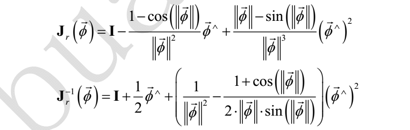
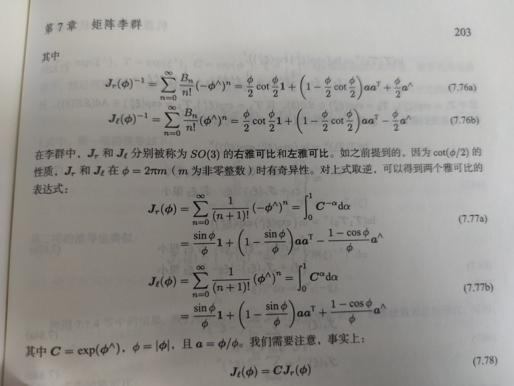

## 迭代：对代码进行修正和完善（2021.11.10）

主要参考邱笑晨博士的《预积分总结与公式推导20180729》以及VINS-MONO代码检查，也感谢梓杰大佬的帮助。

主要修正的部分如下（还有些小修补就不再赘述）：

1. **雅各比矩阵推导：**

   ```c++
   jacobian_i.block<3, 3>(INDEX_R, INDEX_G) \
                 = -J_r_inv 
                 * Sophus::SO3d::exp(resid.block<3, 1>(INDEX_R, 0)).matrix().inverse() 
                 * JacobianR(J_.block<3, 3>(INDEX_R, INDEX_G) * (b_g_i - m_.block<3, 1>(INDEX_G, 0))) 
                 * J_.block<3, 3>(INDEX_R, INDEX_G);
   ```

2. **右乘BCH及其求逆公式**

   这里用到了雅各比BCH的**右乘**近似公式，原先代码采用的是邱博中表述，即：

   

   但是经过陈梓杰提醒，发现这个表述和机器人学中的状态估计中的**表述不一致**，表述为：

   

   对两者进行了实验检查，发现**机器人状态估计中的表述更加准确**。虽然两者对迭代时候cost值影响不大，但是精度还是有一定的差别的，借用vins的检查雅各比矩阵也能看出差异。

   最终代码表述为：

   ```c++
     static Eigen::Matrix3d JacobianRInv(const Eigen::Vector3d &w)
     {
       Eigen::Matrix3d J_r_inv = Eigen::Matrix3d::Identity();
   
       double theta = w.norm();
   
       if (theta > 1e-5)
       {
         Eigen::Vector3d a = w.normalized();
         Eigen::Matrix3d a_hat = Sophus::SO3d::hat(a);
         double theta_half = 0.5 * theta;
         double cot_theta = 1.0 / tan(theta_half);
   
         J_r_inv = theta_half * cot_theta * J_r_inv + (1.0 - theta_half * cot_theta) * a * a.transpose() + theta_half * a_hat;
       }
   
       return J_r_inv;
     }
   
     static Eigen::Matrix3d JacobianR(const Eigen::Vector3d &w)
     {
       Eigen::Matrix3d J_r = Eigen::Matrix3d::Identity();
   
       double theta = w.norm();
   
       if (theta > 1e-5)
       {
         Eigen::Vector3d a = w.normalized();
         Eigen::Matrix3d a_hat = Sophus::SO3d::hat(a);
   
         J_r = sin(theta) / theta * Eigen::Matrix3d::Identity() + (1.0 - sin(theta) / theta) * a * a.transpose() - (1.0 - cos(theta)) / theta * a_hat;
       }
   
       return J_r;
     }
   ```

   

