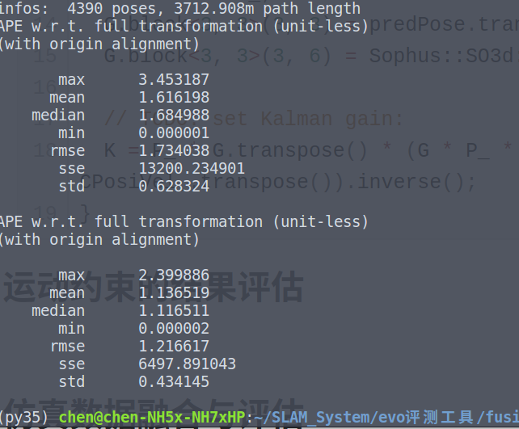

## Task 10 作业说明文档

根据助教老师建议，本课程笔记、作业均已经迁移至我的github上：[链接](https://github.com/ChenJiahao031008/sensor-fusion-for-slam). 

[TOC]

### 1 代码补全

由于比较菜，本次作业卡壳了两次，因此部分代码借鉴了VINS-MONO的源码和博客。对于相关代码的理解和思路见下文中程序注释，就不再单独陈述。 

1. `factor_prvag_imu_pre_integration.hpp`

   ```c++
   // TODO: get square root of information matrix:
   // Cholesky 分解 : http://eigen.tuxfamily.org/dox/classEigen_1_1LLT.html
   Eigen::LLT<Eigen::Matrix<double,15,15>> LowerI(I_);
   // sqrt_info 为上三角阵
   Eigen::Matrix<double,15,15> sqrt_info = LowerI.matrixL().transpose();
   
   
   // TODO: compute residual:
   const Sophus::SO3d ori_ij = Sophus::SO3d::exp(theta_ij);
   const Eigen::Matrix3d oriRT_i = ori_i.inverse().matrix();
   // const Eigen::Matrix3d oriRT_i = ori_i.matrix().transpose();
   // Eigen::Matrix<double, 15, 1> resid;
   // resid.setZero();
   Eigen::Map<Eigen::Matrix<double, 15, 1> > resid(residuals);
   // 有向量计算，转换为矩阵再进行(但是可以不转换，即 ori_i.inverse() == ori_i.matrix().transpose())
   resid.block<3, 1>(INDEX_P, 0) = oriRT_i * (pos_j - pos_i - vel_i * T_ + 0.5 * g_ * T_ * T_) - alpha_ij;
   // 由于全是向量计算，所以不用再转换为矩阵了
   resid.block<3, 1>(INDEX_R, 0) = (ori_ij.inverse() * ( ori_i.inverse() * ori_j ) ).log();
   resid.block<3, 1>(INDEX_V, 0) = oriRT_i * ( vel_j - vel_i + g_ * T_) - beta_ij;
   resid.block<3, 1>(INDEX_A, 0) = b_a_j - b_a_i;
   resid.block<3, 1>(INDEX_G, 0) = b_g_j - b_g_i;
   // residuals[0] = resid
   
   // TODO: compute jacobians:
   if ( jacobians ) {
   	// compute shared intermediate results:
   	Eigen::Map<Eigen::Matrix<double,15,15,Eigen::RowMajor>> jacobian_i(jacobians[0]);
   	Eigen::Map<Eigen::Matrix<double,15,15,Eigen::RowMajor>> jacobian_j(jacobians[1]);
   	jacobian_i.setZero();
   	jacobian_j.setZero();
   
   	const Eigen::Vector3d deltaR = resid.block<3, 1>(INDEX_R, 0);
   	const Eigen::Matrix3d J_r_inv = JacobianRInv(deltaR);
   
   	if ( jacobians[0] ) {
           // a. residual, position:
           jacobian_i.block<3, 3>(INDEX_P, INDEX_P) = -oriRT_i;
           jacobian_i.block<3, 3>(INDEX_P, INDEX_R) = Sophus::SO3d::hat(oriRT_i * (pos_j - pos_i - vel_i * T_ + 0.50 * g_ * T_ * T_));
           jacobian_i.block<3, 3>(INDEX_P, INDEX_V) = -oriRT_i * T_;
           jacobian_i.block<3, 3>(INDEX_P, INDEX_A) = -J_.block<3, 3>(INDEX_P,INDEX_A);
           jacobian_i.block<3, 3>(INDEX_P, INDEX_G) = -J_.block<3, 3>(INDEX_P,INDEX_G);
   
           // b. residual, orientation:
           jacobian_i.block<3, 3>(INDEX_R, INDEX_R) = -J_r_inv * (ori_j.inverse() * ori_i).matrix();
           jacobian_i.block<3, 3>(INDEX_R, INDEX_G) = -J_r_inv * (Sophus::SO3d::exp(resid.block<3, 1>(INDEX_R, 0))).matrix().inverse() * J_.block<3, 3>(INDEX_R, INDEX_G);
   
           // c. residual, velocity:
           jacobian_i.block<3, 3>(INDEX_V, INDEX_R) =  Sophus::SO3d::hat(ori_i.inverse() * (vel_j - vel_i + g_ * T_));
           jacobian_i.block<3, 3>(INDEX_V, INDEX_V) = -oriRT_i;
           jacobian_i.block<3, 3>(INDEX_V, INDEX_A) = -J_.block<3, 3>(INDEX_V, INDEX_A);
           jacobian_i.block<3, 3>(INDEX_V, INDEX_G) = -J_.block<3, 3>(INDEX_V, INDEX_G);
   
           // d. residual, bias accel:
           jacobian_i.block<3, 3>(INDEX_A, INDEX_A) =  -Eigen::Matrix3d::Identity();
           jacobian_i.block<3, 3>(INDEX_G, INDEX_G) =  -Eigen::Matrix3d::Identity();
       }
   
       if ( jacobians[1] ) {
           // a. residual, position:
           jacobian_j.block<3,3>(INDEX_P,INDEX_P) = oriRT_i;
           // b. residual, orientation:
           jacobian_j.block<3,3>(INDEX_R,INDEX_R) = J_r_inv;
           // c. residual, velocity:
           jacobian_j.block<3,3>(INDEX_V,INDEX_V) = oriRT_i;
           // d. residual, bias accel:
           jacobian_j.block<3,3>(INDEX_A,INDEX_A) = Eigen::Matrix3d::Identity();
           jacobian_j.block<3,3>(INDEX_G,INDEX_G) = Eigen::Matrix3d::Identity();
       }
       
       jacobian_i = sqrt_info * jacobian_i;
       jacobian_j = sqrt_info * jacobian_j;
   }
   	// TODO: correct residual by square root of information matrix:
   	resid = sqrt_info * resid;
   ```

2. `factor_prvag_map_matching_pose.hpp`

   ```c++
   virtual bool Evaluate(double const *const *parameters, double *residuals, double **jacobians) const {
       // parse parameters:
       // pose
       Eigen::Map<const Eigen::Vector3d>     pos(&parameters[0][INDEX_P]);
       Eigen::Map<const Eigen::Vector3d> log_ori(&parameters[0][INDEX_R]);
       const Sophus::SO3d                    ori = Sophus::SO3d::exp(log_ori);
   
       // parse measurement:
   	const Eigen::Vector3d     &pos_prior = m_.block<3, 1>(INDEX_P, 0);
   	const Eigen::Vector3d &log_ori_prior = m_.block<3, 1>(INDEX_R, 0);
       const Sophus::SO3d         ori_prior = Sophus::SO3d::exp(log_ori_prior);
   
       // TODO: get square root of information matrix:
       // Cholesky 分解 : http://eigen.tuxfamily.org/dox/classEigen_1_1LLT.html
       Eigen::LLT< Eigen::Matrix<double, 6, 6> > LowerI(I_);
       // sqrt_info 为上三角阵
       Eigen::Matrix<double, 6, 6> sqrt_info = LowerI.matrixL().transpose();
   
       // TODO: compute residual:
       // Eigen::Matrix<double, 6, 1> resid;
       // resid.setZero();
       Eigen::Map<Eigen::Matrix<double, 6, 1> > resid(residuals);
       resid.block<3, 1>(INDEX_P, 0) = pos - pos_prior;
       resid.block<3, 1>(INDEX_R, 0) = (ori * ori_prior.inverse()).log();
       // residuals[0] = resid;
   
       // TODO: compute jacobians:
       if ( jacobians ) {
         Eigen::Map<Eigen::Matrix<double, 6, 15, Eigen::RowMajor>> jacobian_(jacobians[0]);
         jacobian_.setZero();
   
         const Eigen::Vector3d deltaR = resid.block<3, 1>(INDEX_R, 0);
         const Eigen::Matrix3d J_r_inv = JacobianRInv(deltaR);
   
         if ( jacobians[0] ) {
           // implement jacobian computing:
           jacobian_.block<3, 3>(INDEX_P, INDEX_P) = Eigen::Matrix3d::Identity();
           jacobian_.block<3, 3>(INDEX_R, INDEX_R) = J_r_inv * ori_prior.matrix();
         }
   
         jacobian_ = sqrt_info * jacobian_;
       }
   	// TODO: correct residual by square root of information matrix:
       resid = sqrt_info * resid;
   
       return true;
     }
   ```

3. `factor_prvag_relative_pose.hpp`

   ```c++
   virtual bool Evaluate(double const *const *parameters, double *residuals, double **jacobians) const {
       // parse parameters:
       // a. pose i
       Eigen::Map<const Eigen::Vector3d>     pos_i(&parameters[0][INDEX_P]);
       Eigen::Map<const Eigen::Vector3d> log_ori_i(&parameters[0][INDEX_R]);
       const Sophus::SO3d                    ori_i = Sophus::SO3d::exp(log_ori_i);
   
       // b. pose j
       Eigen::Map<const Eigen::Vector3d>     pos_j(&parameters[1][INDEX_P]);
       Eigen::Map<const Eigen::Vector3d> log_ori_j(&parameters[1][INDEX_R]);
       const Sophus::SO3d                    ori_j = Sophus::SO3d::exp(log_ori_j);
   
       // parse measurement:
       const Eigen::Vector3d     &pos_ij = m_.block<3, 1>(INDEX_P, 0);
       const Eigen::Vector3d &log_ori_ij = m_.block<3, 1>(INDEX_R, 0);
       const Sophus::SO3d         ori_ij = Sophus::SO3d::exp(log_ori_ij);
   
       // TODO: get square root of information matrix:
       Eigen::LLT< Eigen::Matrix<double, 6, 6> > LowerI(I_);
       Eigen::Matrix<double, 6, 6> sqrt_info = LowerI.matrixL().transpose();
   
       // TODO: compute residual:
       // Eigen::Matrix<double, 6, 1> resid;
       // resid.setZero();
       Eigen::Map<Eigen::Matrix<double, 6, 1> > resid(residuals);
       const Eigen::Matrix3d oriRT_i = ori_i.inverse().matrix();
   
       resid.block<3, 1>(INDEX_P, 0) = oriRT_i * (pos_j - pos_i) - pos_ij;
       resid.block<3, 1>(INDEX_R, 0) = ( ori_i.inverse() * ori_j * ori_ij.inverse() ).log();
       // residuals[0] = resid;
   
       // TODO: compute jacobians:
       if ( jacobians ) {
         // compute shared intermediate results:
         Eigen::Map<Eigen::Matrix<double,6,15,Eigen::RowMajor>> jacobian_i(jacobians[0]);
         Eigen::Map<Eigen::Matrix<double,6,15,Eigen::RowMajor>> jacobian_j(jacobians[1]);
         jacobian_i.setZero();
         jacobian_j.setZero();
   
         const Eigen::Vector3d deltaR = resid.block<3, 1>(INDEX_R, 0);
         const Eigen::Matrix3d J_r_inv = JacobianRInv(deltaR);
   
   
         if ( jacobians[0] ) {
           jacobian_i.block<3, 3>(INDEX_P, INDEX_P) = -oriRT_i;
           // jacobian_i.block<3, 3>(INDEX_P, INDEX_R) =  oriRT_i * Sophus::SO3d::hat(pos_j - pos_i);
           jacobian_i.block<3, 3>(INDEX_R, INDEX_R) = -J_r_inv * (ori_ij * ori_j.inverse() * ori_i ).matrix();
         }
   
         if ( jacobians[1] ) {
           jacobian_j.block<3, 3>(INDEX_P, INDEX_P) = oriRT_i;
           jacobian_j.block<3, 3>(INDEX_R, INDEX_R) = J_r_inv * ori_ij.matrix();
         }
   
         // TODO: correct residuals by square root of information matrix:
         jacobian_i = sqrt_info * jacobian_i;
         jacobian_j = sqrt_info * jacobian_j;
   
       }
   
       resid = sqrt_info * resid;
   
       return true;
     }
   ```

4. `factor_prvag_marginalization.hpp`

   ```c++
   void SetResMapMatchingPose(
       const ceres::CostFunction *residual,
       const std::vector<double *> &parameter_blocks
     ) {
      	.......
   	// TODO: Update H:
       // a. H_mm:
       const Eigen::MatrixXd H_mm = J_m.transpose() * J_m;
       H_.block<15, 15>(INDEX_M, INDEX_M) += H_mm;
   
       // TODO: Update b:
       // a. b_m:
       const Eigen::MatrixXd b_m = J_m.transpose() * residuals;
       b_.block<15, 1>(INDEX_M, 0) += b_m;
       .......
   }
   
   void SetResRelativePose(
       const ceres::CostFunction *residual,
       const std::vector<double *> &parameter_blocks
     ) {
       ......
   	// TODO: Update H:
       // 注意顺序
       // a. H_mm:
       const Eigen::MatrixXd H_mm = J_m.transpose() * J_m;
       H_.block<15, 15>(INDEX_M, INDEX_M) += H_mm;
       // b. H_mr:
       const Eigen::MatrixXd H_mr = J_m.transpose() * J_r;
       H_.block<15, 15>(INDEX_M, INDEX_R) += H_mr;
       // c. H_rm:
       const Eigen::MatrixXd H_rm = J_r.transpose() * J_m;
       H_.block<15, 15>(INDEX_R, INDEX_M) += H_rm;
       // d. H_rr:
       const Eigen::MatrixXd H_rr = J_r.transpose() * J_r;
       H_.block<15, 15>(INDEX_R, INDEX_R) += H_rr;
   
       // TODO: Update b:
       // a. b_m:
       const Eigen::MatrixXd b_m = J_m.transpose() * residuals;
       b_.block<15, 1>(INDEX_M, 0) += b_m;
       // a. b_r:
       const Eigen::MatrixXd b_r = J_r.transpose() * residuals;
       b_.block<15, 1>(INDEX_R, 0) += b_r;
       .....
   }
   
   void SetResIMUPreIntegration(
       const ceres::CostFunction *residual,
       const std::vector<double *> &parameter_blocks
     ) {
       ......
       // TODO: Update H:
       // 注意顺序
       // a. H_mm:
       const Eigen::MatrixXd H_mm = J_m.transpose() * J_m;
       H_.block<15, 15>(INDEX_M, INDEX_M) += H_mm;
       // b. H_mr:
       const Eigen::MatrixXd H_mr = J_m.transpose() * J_r;
       H_.block<15, 15>(INDEX_M, INDEX_R) += H_mr;
       // c. H_rm:
       const Eigen::MatrixXd H_rm = J_r.transpose() * J_m;
       H_.block<15, 15>(INDEX_R, INDEX_M) += H_rm;
       // d. H_rr:
       const Eigen::MatrixXd H_rr = J_r.transpose() * J_r;
       H_.block<15, 15>(INDEX_R, INDEX_R) += H_rr;
   
       //
       // TODO: Update b:
       // a. b_m:
       const Eigen::MatrixXd b_m = J_m.transpose() * residuals;
       b_.block<15, 1>(INDEX_M, 0) += b_m;
       // a. b_r:
       const Eigen::MatrixXd b_r = J_r.transpose() * residuals;
       b_.block<15, 1>(INDEX_R, 0) += b_r;
       ......
   }
   
   void Marginalize(
       const double *raw_param_r_0
     ) {
       // TODO: implement marginalization logic
       //save x_m_0;
       Eigen::Map<const Eigen::Matrix<double, 15, 1> > x_raw(raw_param_r_0);
       // 原始线性化点
       x_0_ = x_raw;
       //marginalize
       const Eigen::MatrixXd H_mm_ = H_.block<15, 15>(INDEX_M, INDEX_M);
       const Eigen::MatrixXd H_mr_ = H_.block<15, 15>(INDEX_M, INDEX_R);
       const Eigen::MatrixXd H_rm_ = H_.block<15, 15>(INDEX_R, INDEX_M);
       const Eigen::MatrixXd H_rr_ = H_.block<15, 15>(INDEX_R, INDEX_R);
       const Eigen::VectorXd b_m_  = b_.block<15,  1>(INDEX_M, 0);
       const Eigen::VectorXd b_r_  = b_.block<15,  1>(INDEX_R, 0);
   
       Eigen::MatrixXd H_tmp = H_rr_ - H_rm_ * ( H_mm_.inverse() ) * H_mr_;
       Eigen::MatrixXd b_tmp = b_r_ - H_rm_ * ( H_mm_.inverse() ) * b_m_;
       // case1 : 直接求解 failed
   
       // case2 : SelfAdjointEigenSolver,特征分解
       // H_tmp 是对称矩阵，所以是hermitian矩阵，
       // 代码中使用Eigen::SelfAdjointEigenSolver完成对herrmitian的SVD分解。得到:
       Eigen::SelfAdjointEigenSolver<Eigen::MatrixXd> saes(H_tmp);
       // 这部分参考vins代码: https://zhuanlan.zhihu.com/p/51330624；(但是公式好像有点问题，思路是差不多的)
       // H = J.t() * J = V * S * V.t() = ( S.sqrt() * V.t() ).t() * ( S.sqrt() * V.t() )
       //   >> J = S.sqrt() * V.t()
       // b = J.t() * f
       //   >> f = ( J.t() )^{-1} * b = V * S.sqrt() * b
   
       // (R.array() > s).select(P,Q)  -> (R > s ? P : Q)
       Eigen::VectorXd S = Eigen::VectorXd((saes.eigenvalues().array() > 1.0e-5).select(saes.eigenvalues().array(), 0));
       // eigenvalues().array().inverse() ：这一步没有找到资料，但是猜测是对每个元素求逆，即求倒数
       Eigen::VectorXd S_inv = Eigen::VectorXd((saes.eigenvalues().array() > 1.0e-5).select(saes.eigenvalues().array().inverse(), 0));
   
       // cwiseSqrt : 对每个元素做sqrt()处理
       Eigen::VectorXd S_sqrt = S.cwiseSqrt();
       Eigen::VectorXd S_inv_sqrt = S_inv.cwiseSqrt(); // S^{-1/2}
       // 从边缘化后的信息矩阵中恢复出来雅克比矩阵linearized_jacobians和残差linearized_residuals，
       // 这两者会作为先验残差带入到下一轮的先验残差的雅克比和残差的计算当中去
       // J = S^{1/2} * V.t()
       J_ = S_sqrt.asDiagonal() * saes.eigenvectors().transpose();
       // e_0 = (V * S^{-1/2}).t() * b
       e_ = S_inv_sqrt.asDiagonal() * saes.eigenvectors().transpose() * b_tmp;
   }
   
   
   virtual bool Evaluate(double const *const *parameters, double *residuals, double **jacobians) const {
       // parse parameters:
       Eigen::Map<const Eigen::Matrix<double, 15, 1>> x(parameters[0]);
       Eigen::VectorXd dx = x - x_0_;
   
       // TODO: compute residual:
       Eigen::Map< Eigen::Matrix<double, 15, 1> > residual(residuals);
       // TODO:
       // 先验残差的更新：可以使用一阶泰勒近似
       residual = e_ + J_ * dx;
   
       // TODO: compute jacobian:
       if ( jacobians ) {
         if ( jacobians[0] ) {
           Eigen::Map<Eigen::Matrix<double, 15, 15, Eigen::RowMajor> > jacobian_(jacobians[0]);
           jacobian_ = J_;
         }
       }
   
       return true;
   }
   ```

5. `ceres_sliding_window.cpp`

   ```c++
   bool SlidingWindow::Update(void) {
       static KeyFrame last_key_frame_ = current_key_frame_;
   
       // add node for new key frame pose:
       // fix the pose of the first key frame for lidar only mapping:
       if ( sliding_window_ptr_->GetNumParamBlocks() == 0 ) {
           // TODO: add init key frame
           sliding_window_ptr_->AddPRVAGParam(current_key_frame_, true);
       } else {
           // TODO: add current key frame
           sliding_window_ptr_->AddPRVAGParam(current_key_frame_, false);
       }
   
       // get num. of vertices:
       const int N = sliding_window_ptr_->GetNumParamBlocks();
       // get param block ID, current:
       const int param_index_j = N - 1;
   
       // add unary constraints:
       // a. map matching / GNSS position:
       if ( N > 0 && measurement_config_.source.map_matching ) {
   	// get prior position measurement:
   	Eigen::Matrix4d prior_pose = current_map_matching_pose_.pose.cast<double>();
   
   	// TODO: add constraint, GNSS position:
   	sliding_window_ptr_->AddPRVAGMapMatchingPoseFactor(
               param_index_j,
               prior_pose, measurement_config_.noise.map_matching);
       }
   
       // add binary constraints:
       if ( N > 1 ) {
           // get param block ID, previous:
           const int param_index_i = N - 2;
   
           // a. lidar frontend:
           // get relative pose measurement:
           Eigen::Matrix4d relative_pose = (last_key_frame_.pose.inverse() * current_key_frame_.pose).cast<double>();
           // TODO: add constraint, lidar frontend / loop closure detection:
           sliding_window_ptr_->AddPRVAGRelativePoseFactor(
               param_index_i, param_index_j,
               relative_pose, measurement_config_.noise.lidar_odometry);
           // b. IMU pre-integration:
           if ( measurement_config_.source.imu_pre_integration ) {
               // TODO: add constraint, IMU pre-integraion:
               sliding_window_ptr_->AddPRVAGIMUPreIntegrationFactor(
                   param_index_i, param_index_j,
                   imu_pre_integration_);
           }
       }
   
       // move forward:
       last_key_frame_ = current_key_frame_;
   
       return true;
   }
   ```

6. `sliding_window.cpp`

   ```c++
   bool CeresSlidingWindow::Optimize() {
       static int optimization_count = 0;
   
       // get key frames count:
       const int N = GetNumParamBlocks();
   
       if (
           (kWindowSize + 1 <= N)
       ) {
           // TODO: create new sliding window optimization problem:
           ceres::Problem problem;
   
           // TODO: a. add parameter blocks:
           for ( int i = 1; i <= kWindowSize + 1; ++i) {
               auto &target_key_frame = optimized_key_frames_.at(N - i);
   
               ceres::LocalParameterization *local_parameterization = new sliding_window::ParamPRVAG();
   
               // TODO: add parameter block:
               problem.AddParameterBlock(target_key_frame.prvag, 15, local_parameterization);
               // fixed bugs: 一开始没有注意到fixed的问题
               if (target_key_frame.fixed)
               {
                   problem.SetParameterBlockConstant(target_key_frame.prvag);
               }
           }
   
           // TODO: add residual blocks:
           // b.1. marginalization constraint:
           if (
               !residual_blocks_.map_matching_pose.empty() &&
               !residual_blocks_.relative_pose.empty() &&
               !residual_blocks_.imu_pre_integration.empty()
           ) {
               auto &key_frame_m = optimized_key_frames_.at(N - kWindowSize - 1);
               auto &key_frame_r = optimized_key_frames_.at(N - kWindowSize - 0);
   
               const ceres::CostFunction *factor_map_matching_pose = GetResMapMatchingPose(
                   residual_blocks_.map_matching_pose.front()
               );
               const ceres::CostFunction *factor_relative_pose = GetResRelativePose(
                   residual_blocks_.relative_pose.front()
               );
               const ceres::CostFunction *factor_imu_pre_integration = GetResIMUPreIntegration(
                   residual_blocks_.imu_pre_integration.front()
               );
   
               sliding_window::FactorPRVAGMarginalization *factor_marginalization = new sliding_window::FactorPRVAGMarginalization();
   
               factor_marginalization->SetResMapMatchingPose(
                   factor_map_matching_pose,
                   std::vector<double *>{key_frame_m.prvag}
               );
               factor_marginalization->SetResRelativePose(
                   factor_relative_pose,
                   std::vector<double *>{key_frame_m.prvag, key_frame_r.prvag}
               );
               factor_marginalization->SetResIMUPreIntegration(
                   factor_imu_pre_integration,
                   std::vector<double *>{key_frame_m.prvag, key_frame_r.prvag}
               );
               factor_marginalization->Marginalize(key_frame_r.prvag);
   
               // add marginalization factor into sliding window
               problem.AddResidualBlock(
                   factor_marginalization,
                   NULL,
                   key_frame_r.prvag
               );
   
   
               residual_blocks_.map_matching_pose.pop_front();
               residual_blocks_.relative_pose.pop_front();
               residual_blocks_.imu_pre_integration.pop_front();
           }
   
           // TODO: b.2. map matching pose constraint:
           if ( !residual_blocks_.map_matching_pose.empty() ) {
               for ( const auto &residual_map_matching_pose: residual_blocks_.map_matching_pose ) {
                   auto &key_frame = optimized_key_frames_.at(residual_map_matching_pose.param_index);
   
                   sliding_window::FactorPRVAGMapMatchingPose *factor_map_matching_pose = GetResMapMatchingPose(
                       residual_map_matching_pose
                   );
   
                   // TODO: add map matching factor into sliding window
                   factor_map_matching_pose->SetMeasurement(residual_map_matching_pose.m);
                   factor_map_matching_pose->SetInformation(residual_map_matching_pose.I);
   
                   problem.AddResidualBlock(
                       factor_map_matching_pose,
                       NULL,
                       key_frame.prvag);
               }
           }
   
           // TODO: b.3. relative pose constraint:
           if ( !residual_blocks_.relative_pose.empty() ) {
               for ( const auto &residual_relative_pose: residual_blocks_.relative_pose ) {
                   auto &key_frame_i = optimized_key_frames_.at(residual_relative_pose.param_index_i);
                   auto &key_frame_j = optimized_key_frames_.at(residual_relative_pose.param_index_j);
   
                   sliding_window::FactorPRVAGRelativePose *factor_relative_pose = GetResRelativePose(
                       residual_relative_pose
                   );
   
                   // TODO: add relative pose factor into sliding window
                   factor_relative_pose->SetMeasurement(residual_relative_pose.m);
                   factor_relative_pose->SetInformation(residual_relative_pose.I);
   
                   problem.AddResidualBlock(
                       factor_relative_pose,
                       NULL,
                       key_frame_i.prvag, key_frame_j.prvag);
               }
           }
   
           // TODO: b.4. IMU pre-integration constraint
           if ( !residual_blocks_.imu_pre_integration.empty() ) {
               for ( const auto &residual_imu_pre_integration: residual_blocks_.imu_pre_integration ) {
                   auto &key_frame_i = optimized_key_frames_.at(residual_imu_pre_integration.param_index_i);
                   auto &key_frame_j = optimized_key_frames_.at(residual_imu_pre_integration.param_index_j);
   
                   sliding_window::FactorPRVAGIMUPreIntegration *factor_imu_pre_integration = GetResIMUPreIntegration(
                       residual_imu_pre_integration
                   );
   
                   // TODO: add IMU factor into sliding window
                   factor_imu_pre_integration->SetT(residual_imu_pre_integration.T);
                   factor_imu_pre_integration->SetGravitiy(residual_imu_pre_integration.g);
                   factor_imu_pre_integration->SetMeasurement(residual_imu_pre_integration.m);
                   factor_imu_pre_integration->SetInformation(residual_imu_pre_integration.I);
                   factor_imu_pre_integration->SetJacobian(residual_imu_pre_integration.J);
   
                   problem.AddResidualBlock(
                       factor_imu_pre_integration,
                       NULL,
                       key_frame_i.prvag, key_frame_j.prvag);
               }
           }
   
           // solve:
           ceres::Solver::Summary summary;
   
           auto start = std::chrono::steady_clock::now();
           ceres::Solve(config_.options, &problem, &summary);
           auto end = std::chrono::steady_clock::now();
           std::chrono::duration<double> time_used = end-start;
   
           // prompt:
           LOG(INFO) << "------ Finish Iteration " << ++optimization_count << " of Sliding Window Optimization -------" << std::endl
                     << "Time Used: " << time_used.count() << " seconds." << std::endl
                     << "Cost Reduced: " << summary.initial_cost - summary.final_cost << std::endl
                     << summary.BriefReport() << std::endl
                     << std::endl;
   
           return true;
       }
   
       return false;
   }
   ```

7. 最终效果

   + 原始版本：

     + 实际表现：

       | 指标/方法 |  laser_odom  |  optimized   |
       | :-------: | :----------: | :----------: |
       |    max    |   9.402877   | **9.221500** |
       |   mean    | **6.385238** |   6.433677   |
       |  median   | **6.422193** |   6.549704   |
       |    min    | **0.000001** | **0.000001** |
       |   rmse    |   6.560088   | **6.557473** |
       |    std    |   1.504492   | **1.268173** |

   + 调参版本：**更换地图，调整参数**

     + 参数修改：

       ```yaml
       lidar_odometry:
           noise: [1.0, 1.0, 1.0, 0.01, 0.01, 0.01] # x y z yaw roll pitch
       
       map_matching:
           noise: [0.05, 0.05, 1.0, 0.005, 0.005, 0.005] # x y z yaw roll pitch
       # 实际上没用
       gnss_position:
           noise: [0.05, 0.05, 1.0] # x y z
       
       imu_pre_integration:
           earth:
               # gravity can be calculated from https://www.sensorsone.com/local-gravity-calculator/ using latitude and height:
               gravity_magnitude: 9.80943
           covariance:
               measurement:
                   accel: 2.5e-1
                   gyro: 1.0e-2
               random_walk:
                   accel: 1.0e-3
                   gyro: 1.0e-3
       ```

     + 实际表现：

       | 指标/方法 |  laser_odom  |  optimized   |
       | :-------: | :----------: | :----------: |
       |    max    |   3.317282   | **3.361368** |
       |   mean    |   1.545114   | **0.253861** |
       |  median   |   1.589696   | **0.190392** |
       |    min    | **0.000001** | **0.000001** |
       |   rmse    |   1.675192   | **0.342759** |
       |    std    |   0.647218   | **0.230300** |

### 2 与EKF程序效果对比

EKF的实验参考第八章节作业，在相同配置下得到结论：经过调参后，基于图优化的方法与基于滤波的结果相比有较大提升。下图为Task8数据：



### 3 滑动窗口数目对与性能的影响

全部实验采用调整过的参数进行，比较的指标采用RMES。具体细节可以参考`RESULTS`文件夹。

| 次数 | 2        | 5        | 10           | 15       | 20       | 25       |
| ---- | -------- | -------- | ------------ | -------- | -------- | -------- |
| RMES | 0.832806 | 0.940843 | **0.277835** | 0.327291 | 0.342759 | 0.953997 |

可以看出，选取适当的滑动窗口大小是必要的，能够直接影响最终的性能。

