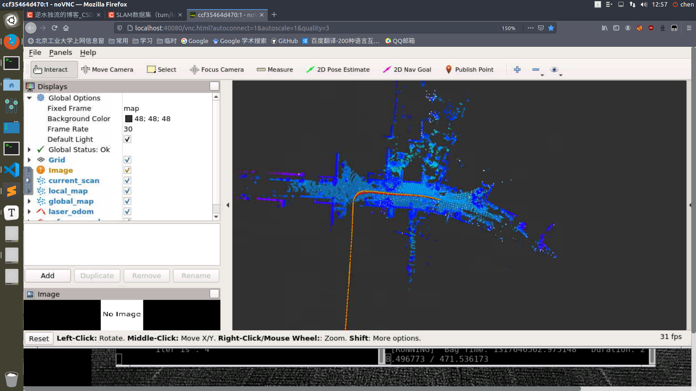
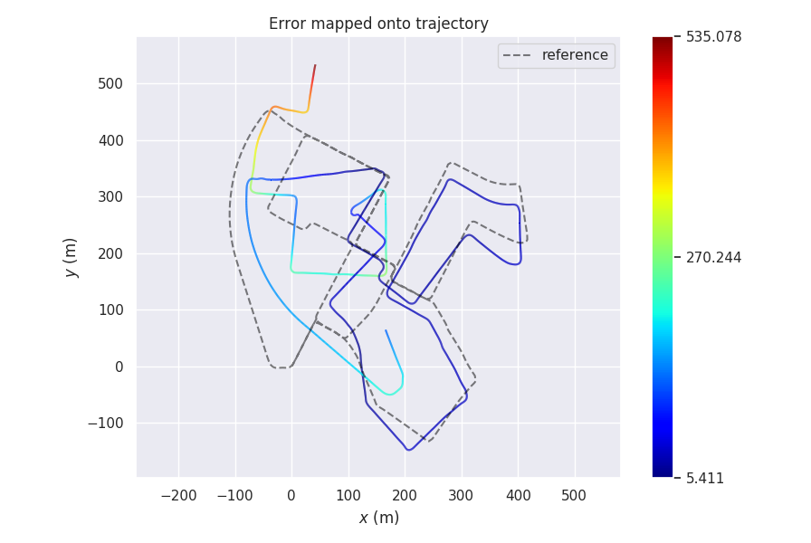
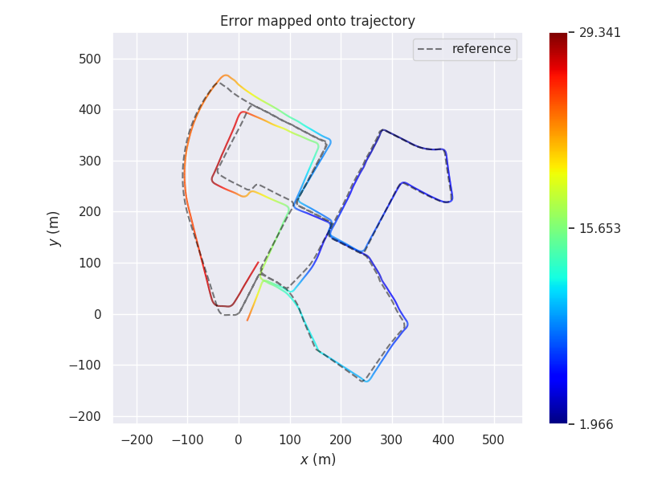
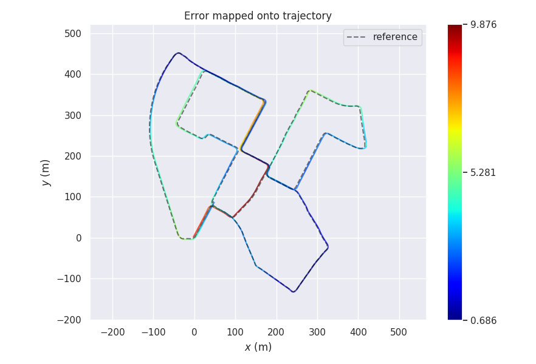

## Task 2 作业说明文档

[TOC]

### 1. 基本框架的搭建和调试



### 2. ICP-SVD方法的实现

详细代码见 `doc/icp_svd_registration.cpp`文件下，主要代码框架如下：

```c++
bool ICPSVDRegistration::ScanMatch(
    const CloudData::CLOUD_PTR& input_source,
    const Eigen::Matrix4f& predict_pose,
    CloudData::CLOUD_PTR& result_cloud_ptr,
    Eigen::Matrix4f& result_pose
) {
    input_source_ = input_source;

    // pre-process input source:
    CloudData::CLOUD_PTR transformed_input_source(new CloudData::CLOUD());
    // 首先进行粗定位，减少搜索范围
    pcl::transformPointCloud(*input_source_, *transformed_input_source, predict_pose);

    // init estimation:
    transformation_.setIdentity();

    //
    // TODO: first option -- implement all computing logic on your own
    //
    // do estimation:
    pcl::PointCloud<pcl::PointXYZ>::Ptr cloud_source_trans(new pcl::PointCloud<pcl::PointXYZ>());
    cloud_source_trans = input_source_;
    int curr_iter = 0;
    while (curr_iter < max_iter_) {
        // TODO: apply current estimation:
        // 初始化
        std::vector<Eigen::Vector3f> xs, ys;
        Eigen::Matrix4f tmp_transformation = Eigen::Matrix4f::Identity();
        CloudData::CLOUD_PTR tmp_input_source(new CloudData::CLOUD());
        pcl::transformPointCloud(*transformed_input_source, *tmp_input_source, transformation_);

        // TODO: get correspondence:
        int nCorrespondences = GetCorrespondence(tmp_input_source, xs, ys);

        // TODO: do not have enough correspondence -- break:
        if (nCorrespondences < 5)
            break;

        // TODO: update current transform:
        GetTransform(xs, ys, tmp_transformation);

        // TODO: whether the transformation update is significant:
        // 设置前后两次迭代的转换矩阵的最大容差，一旦迭代小于这个最大容查，
        // 则认为已经收敛到最优解，迭代停止。是迭代终止的第二个条件
        if (IsSignificant(tmp_transformation, trans_eps_) == false){
            std::cout << "[DEBUG] transformation update is not significant" << std::endl;
            std::cout << "        iter is : " << curr_iter << std::endl;
            break;
        }

        // TODO: update transformation:
        transformation_ = tmp_transformation * transformation_;

        ++curr_iter;
    }

    // set output:
    // 对粗定位得到的旋转矩阵进行矫正
    result_pose = transformation_ * predict_pose;

    //归一化（消除warning，保持旋转矩阵特性，很重要！）
    Eigen::Quaternionf qr(result_pose.block<3, 3>(0, 0));
    qr.normalize();
    Eigen::Vector3f t = result_pose.block<3, 1>(0, 3);
    result_pose.setIdentity();
    result_pose.block<3, 3>(0, 0) = qr.toRotationMatrix();
    result_pose.block<3, 1>(0, 3) = t;
    pcl::transformPointCloud(*input_source_, *result_cloud_ptr, result_pose);

    return true;
}
```

+ 值得注意的是，是否规范四元数对结果影响很大

### 3. evo评估结果

从精度上看，`ICP-SVD > NDT > ICP`，符合一般规律。

详细结果评估信息存放在`result/`文件夹下，这里仅仅给出轨迹对比图

1. ICP：

   

2. NDT：

   

3. ICP-SVD：

   

