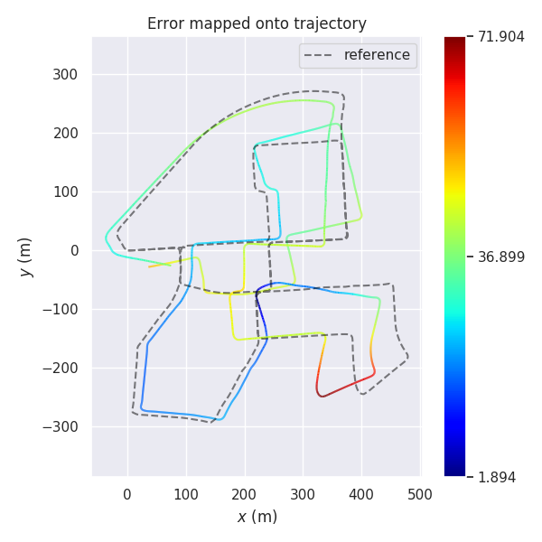

## Task 3 作业说明文档

### 1. 雅各比公式推导

1. 线模型

   + 残差：
     $$
     d_\xi = |X| = \left|\frac{(\tilde{p_i}-p_b)\times(\tilde{p_i}-p_a)}{|p_a-p_b|}\right|
     $$

   + 雅各比：
     $$
     \begin{align}
     J_{\xi} = \frac{\partial{d_\xi}}{\partial T} 
     = &\frac{\partial{d_\xi}}{\partial \tilde{p_i}}\cdot \frac{\partial{\tilde{p_i}}}{\partial T}
     = \frac{\partial{|X|}}{\partial X} \cdot \frac{\partial{X}}{\partial \tilde{p_i}}
     \cdot \frac{\partial{\tilde{p_i}}}{\partial T} \\
     
     \frac{\partial{|X|}}{\partial X} =&  \left[\frac{X}{|X|}\right]^T  = \left[\frac{({\tilde{p_i}}-p_b)\times({\tilde{p_i}}-p_a)}{|({\tilde{p_i}}-p_b)\times({\tilde{p_i}}-p_a)|}\right]^T\\
     
     \frac{\partial{p_i}}{\partial T} =& 
     \begin{bmatrix}
     I & -(Rp_i+t)^{\wedge} \\ \textbf{0}^T & \textbf{0}^T \\ 
     \end{bmatrix}
     =\begin{bmatrix}
     I & -\tilde{p_i}^{\wedge} \\ \textbf{0}^T & \textbf{0}^T
     \end{bmatrix}\\
     
     \frac{\partial{X}}{\partial \tilde{p_i}} = &\frac{1}{|p_a-p_b|}\cdot
     	(\frac{
     		\partial{(\tilde{p_i}-p_b)^{\wedge}(\tilde{p_i}-p_a)}
     	}{\partial(\tilde{p_i}-p_a)}\cdot 
     	\frac{\tilde{p_i}-p_a}{\partial\tilde{p_i}}
         - 
     	\frac{
     		\partial{(\tilde{p_i}-p_a)^{\wedge}(\tilde{p_i}-p_b)}
     	}{\partial({\tilde{p_i}-p_b})}\cdot 
     	\frac{\tilde{p_i}-p_b}{\partial\tilde{p_i}})\\
     
     =&\frac{1}{|p_a-p_b|}\cdot
     	((\tilde{p_i}-p_b)^{\wedge}-(\tilde{p_i}-p_a)^{\wedge})\\
     =& \frac{(p_a-p_b)^{\wedge}}{|p_a-p_b|}\\
     \end{align}
     $$
     为了方便对齐，公式(4)取前3维，此时平移在前，旋转在后（与程序略有差别）。综上，得到结论：
     $$
     J_\xi^{1\times6} = \left[\frac{({\tilde{p_i}}-p_b)\times({\tilde{p_i}}-p_a)}{|({\tilde{p_i}}-p_b)\times({\tilde{p_i}}-p_a)|}\right]^T_{1\times3}
     \cdot \frac{(p_a-p_b)^{\wedge}}{|p_a-p_b|}_{3\times3}
     \cdot [I \quad -\tilde{p_i}^{\wedge}]_{3\times6}
     $$

2. 面模型

   + 残差：
     $$
     d_\mathcal{H} = |X| = \left|(\tilde{p_i}-p_j)\cdot\frac{(p_l-p_j)\times(p_m-p_j)}{|(p_l-p_j)\times(p_m-p_j)|}\right|
     $$

   + 雅各比：
     $$
     \begin{align}
     J_\xi = \frac{\partial{d_{\mathcal{H}}} }{\partial T} =&
     	\frac{\partial{d_{\mathcal{H}}}}{\partial \tilde{p_i}} \cdot
     	\frac{\partial{\tilde{p_i}}}{\partial T}\\
     	=& \frac{\partial{|X|}}{\partial X} \cdot
     	\frac{\partial{X}}{\partial \tilde{p_i}} \cdot
     	\frac{\partial{\tilde{p_i}}}{\partial T}\\
     	
     \frac{\partial{|X|}}{\partial X} =& \frac{X^T}{|X|} = 1\\
     
     \frac{\partial X}{\partial \tilde{p_i}} =&
     \left[
     \frac{(p_l-p_j)\times(p_m-p_j)}{|(p_l-p_j)\times(p_m-p_j)|}
     \right]^T\\
     
     \frac{\partial{p_i}}{\partial T} =& 
     \begin{bmatrix}
     I & -\tilde{p_i}^{\wedge} \\ \textbf{0}^T & \textbf{0}^T \\ 
     \end{bmatrix}\\
     
     J_\xi^{1\times6} = \frac{\partial{d_{\mathcal{H}}} }{\partial T} =& 
     	\left[\frac{(p_l-p_j)\times(p_m-p_j)}
     	{|(p_l-p_j)\times(p_m-p_j)|}\right]_{1\times3}^T
     	\cdot[I \quad -\tilde{p_i}^{\wedge}]_{3\times6}
     \end{align}
     $$

### 2. 代码实现

详细实现部分见`code/`文件夹下。在`aloam_laser_odometry_node.cpp`文件中，当使用`define USE_SCALAR`宏时采用标量计算，否则采用残差向量计算。

关键代码如下：

```c++
class LidarEdgeCostFunctionVector : public ceres::SizedCostFunction<3, 4, 3>
{
public:
	LidarEdgeCostFunctionVector(Eigen::Vector3d curr_point_, Eigen::Vector3d last_point_a_,
						  Eigen::Vector3d last_point_b_, double s_)
		: curr_point(curr_point_), last_point_a(last_point_a_), last_point_b(last_point_b_), s(s_){};
	virtual ~LidarEdgeCostFunctionVector(){};
	virtual bool Evaluate(double const *const *parameters,
						  double *residuals,
						  double **jacobians) const
	{
		Eigen::Map<const Eigen::Quaterniond> q(parameters[0]);
		Eigen::Map<const Eigen::Vector3d> t(parameters[1]);
		Eigen::Quaternion<double> q_last_curr = q;
		Eigen::Quaternion<double> q_identity{1.0, 0.0, 0.0, 0.0};
		q_last_curr = q_identity.slerp(s, q_last_curr).normalized();
		Eigen::Vector3d t_last_curr{s * t[0], s * t[1], s * t[2]};

		Eigen::Vector3d cp = curr_point;
		Eigen::Vector3d lpa = last_point_a;
		Eigen::Vector3d lpb = last_point_b;
		Eigen::Vector3d lp = q_last_curr * cp + t_last_curr;
		Eigen::Vector3d rp = q_last_curr * cp;

		Eigen::Vector3d nu = (lp - lpb).cross(lp - lpa);
		Eigen::Vector3d de = lpa - lpb;
		double de_norm = de.norm();
		// residuals[0] = nu_morm / de_norm;
		residuals[0] = nu.x() / de.norm();
		residuals[1] = nu.y() / de.norm();
		residuals[2] = nu.z() / de.norm();

		// Compute the Jacobian if asked for.
		// 旋转在前，平移在后
		if (jacobians != NULL)
		{
			if (jacobians[0] != NULL)
			{
				Eigen::Matrix3d skew_rp = skew(rp);
				Eigen::Matrix<double, 3, 3> dp_by_so3;
				dp_by_so3.block<3, 3>(0, 0) = -skew_rp;
				Eigen::Map<Eigen::Matrix<double, 3, 4, Eigen::RowMajor> > J_se3(jacobians[0]);
				J_se3.setZero();
				Eigen::Matrix3d skew_de = skew(de);
				J_se3.block<3, 3>(0, 0) = skew_de * dp_by_so3 / de_norm;
			}

			if (jacobians[1] != NULL)
			{
				// Eigen::Matrix3d skew_rp = skew(lp);
				Eigen::Matrix<double, 3, 3> dp_by_t;
				dp_by_t.block<3, 3>(0, 0) = Eigen::Matrix3d::Identity();
				Eigen::Map<Eigen::Matrix<double, 3, 3, Eigen::RowMajor> > J_se3(jacobians[1]);
				J_se3.setZero();
				Eigen::Matrix3d skew_de = skew(de);
				J_se3.block<3, 3>(0, 0) = skew_de * dp_by_t / de_norm;
			}
		}
		return true;
	};

public:
	Eigen::Vector3d curr_point, last_point_a, last_point_b;
	double s;
};

virtual bool Evaluate(double const *const *parameters, double *residuals, double **jacobians) const {
		Eigen::Map<const Eigen::Quaterniond> q_last_curr(parameters[0]);
		Eigen::Map<const Eigen::Vector3d> t_last_curr(parameters[0] + 4);
		Eigen::Vector3d lp;
		lp = q_last_curr * curr_point + t_last_curr;

		Eigen::Vector3d nu = (lp - last_point_a).cross(lp - last_point_b);
		Eigen::Vector3d de = last_point_a - last_point_b;
		double de_norm = de.norm();
		residuals[0] = nu.norm() / de_norm;

		if (jacobians != NULL)
		{
			if (jacobians[0] != NULL)
			{
				Eigen::Matrix3d skew_lp = skew(lp);
				Eigen::Matrix<double, 3, 6> dp_by_se3;
				dp_by_se3.block<3, 3>(0, 0) = -skew_lp;
				(dp_by_se3.block<3, 3>(0, 3)).setIdentity();
				// 这里取前7列但是只用了前6列，最后一列为0
				Eigen::Map<Eigen::Matrix<double, 1, 7, Eigen::RowMajor> > J_se3(jacobians[0]);
				J_se3.setZero();
				Eigen::Matrix3d skew_de = skew(de);
				J_se3.block<1, 6>(0, 0) = -nu.transpose() / nu.norm() * skew_de * dp_by_se3 / de_norm;
			}
		}

		return true;
	};
```

==疑问：==

**目前代码是迁移`f-loam`下对变换矩阵的优化方案进行标量下的解析求导**，向量求导依然保持`a-loam`下风格。

注意到`f-loam`这里的`LocalParameterization`函数是自己实现的。但是在`a-loam`框架下，使用的是`ceres`下预定义的`EigenQuaternionParameterization`。该类的使用非常方便。当我试图重写`CostFunction`，并保持残差形式的书写时，结果非常完美，如上述代码所示。

但是，当我试图修改为残差的标量表示时，结果却表现很差。与之前相比，我修改了`SizedCostFunction`继承类的维度为`<1, 4, 3>`，并设定雅各比矩阵为`<1,4>`和`<1,3>`。**此时结果出现一定的偏差**。我一开始以为是`LocalParameterization`出的问题，但是在自动求导下修改相应模板维度后并没有出现上述问题。并且求导应该也没有太多不同之处。错误的结果如下



修改后的函数在`aloam_factor.hpp`文件的`LidarEdgeCostFunction`函数下，**如果各位助教老师方便的话请点拨一下**。代码如下：

```c++
// 第1个是残差的维度, 第2个是待优化参数的维度。这里是4，表示旋转的四元数, 对应parameters[0]
// 第3个也是待优化参数的维度。这里是3，表示平移量的xyz, 对应parameters[1]。
class LidarEdgeCostFunction : public ceres::SizedCostFunction<1, 4, 3>
{
public:
	LidarEdgeCostFunction(Eigen::Vector3d curr_point_, Eigen::Vector3d last_point_a_,
						  Eigen::Vector3d last_point_b_, double s_)
		: curr_point(curr_point_), last_point_a(last_point_a_), last_point_b(last_point_b_), s(s_) {};
	virtual ~LidarEdgeCostFunction() {};
	virtual bool Evaluate(double const *const *parameters,
						  double *residuals,
						  double **jacobians) const
	{
		// const double *p = parameters[0];
		Eigen::Map<const Eigen::Quaterniond> q(parameters[0]);
		Eigen::Map<const Eigen::Vector3d> t(parameters[1]);
		Eigen::Quaternion<double> q_last_curr = q;
		Eigen::Quaternion<double> q_identity{1.0, 0.0, 0.0, 0.0};
		q_last_curr = q_identity.slerp(s, q_last_curr).normalized();
		Eigen::Vector3d t_last_curr{s * t[0], s * t[1], s * t[2]};

		Eigen::Vector3d cp  = curr_point;
		Eigen::Vector3d lpa = last_point_a;
		Eigen::Vector3d lpb = last_point_b;
		Eigen::Vector3d lp = q_last_curr * cp + t_last_curr;
		Eigen::Vector3d rp = q_last_curr * cp;

		Eigen::Vector3d nu = (lp - lpb).cross(lp - lpa);
		Eigen::Vector3d de = lpa - lpb;
		double res = (nu.norm() * 1.0 / de.norm());
		residuals[0] = res;

		// Compute the Jacobian if asked for.
		// 旋转在前，平移在后
		if (jacobians != NULL)
		{
			if (jacobians[0] != NULL)
			{
				Eigen::Matrix3d skew_de = skew(de);
				Eigen::Matrix3d dp_by_so3 = -skew(rp);
				Eigen::Matrix<double, 1, 3> nu_normalized_t = nu.normalized().transpose();
				Eigen::Map<Eigen::Matrix<double, 1, 4> > J_se3(jacobians[0]);
				J_se3.setZero();
				J_se3.block<1, 3>(0, 0) = nu_normalized_t * skew_de * dp_by_so3 / de.norm();
			}

			if (jacobians[1] != NULL)
			{
				// Eigen::Matrix3d skew_rp = skew(lp);
				Eigen::Matrix3d dp_by_t = Eigen::Matrix3d::Identity();
				Eigen::Map<Eigen::Matrix<double, 1, 3> > J_se3(jacobians[1]);
				J_se3.setZero();
				Eigen::Matrix3d skew_de = skew(de);
				J_se3.block<1, 3>(0, 0) = (nu.normalized().transpose()) * skew_de * dp_by_t /  de.norm();
			}
		}
		return true;
	};

public:
	Eigen::Vector3d curr_point, last_point_a, last_point_b;
	double s;
};
```

### 3. 轨迹评估

在本次作业中分别评估了4种方法，分别是：残差为标量时的自动求导方法，残差为向量时的自动求导方法，残差为标量的解析求导方法，残差为标量的解析求导方法。

更多结果详见`result/`文件夹下，内包含轨迹图，数据分析等多个文件供比较分析。为了节约篇幅，这里仅仅展示轨迹对比结果图。

+ 残差为标量时的自动求导方法

  

+ 残差为向量时的自动求导方法

  

+ 残差为标量的解析求导方法

  

+ 残差为标量的解析求导方法

  

