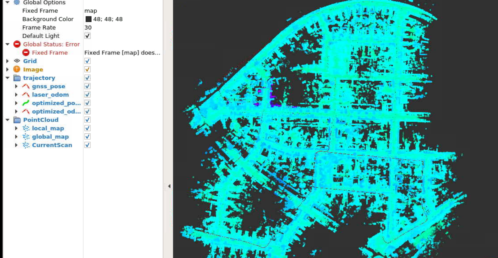
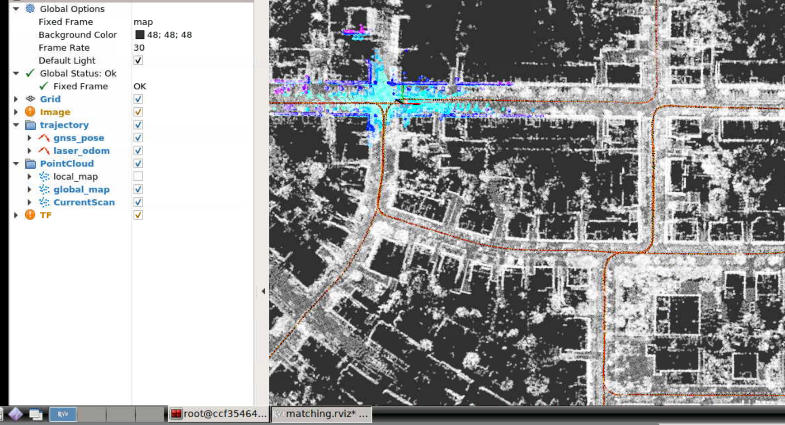
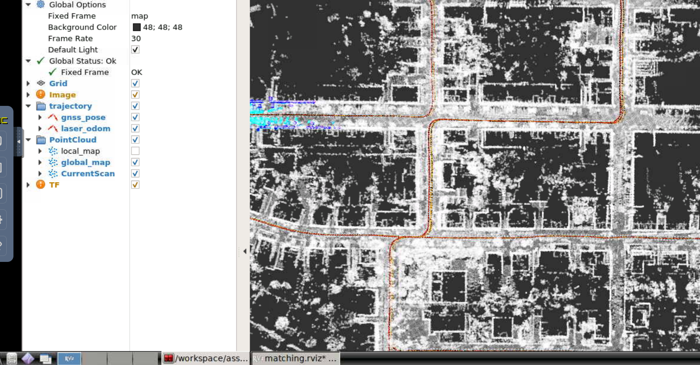
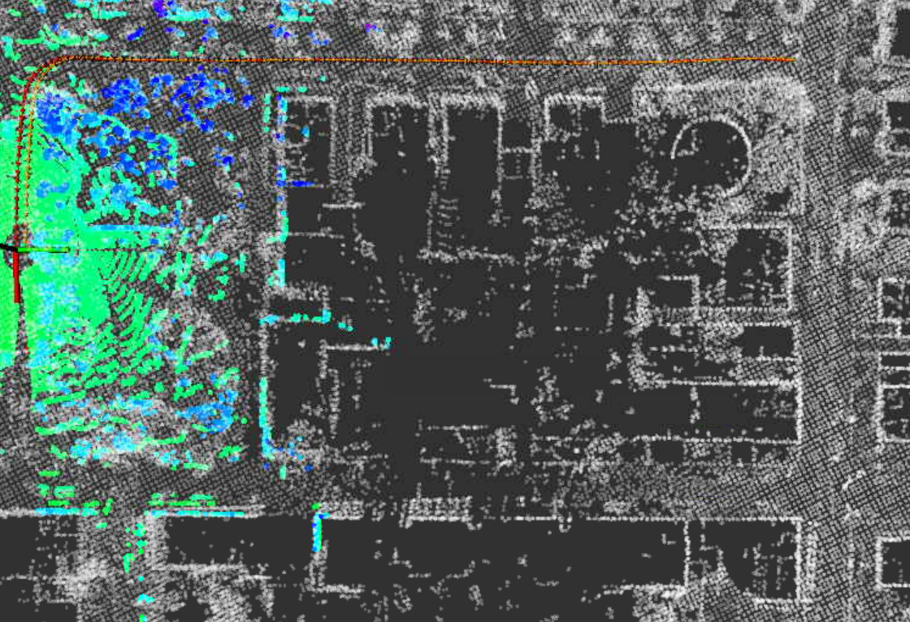
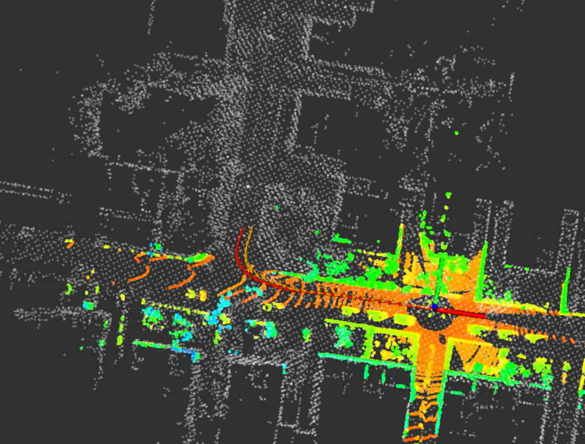
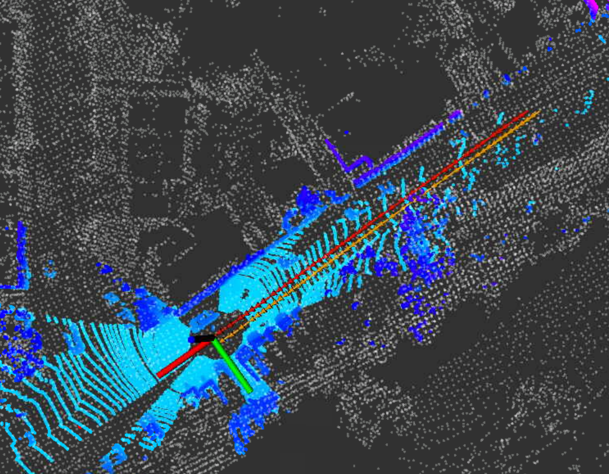
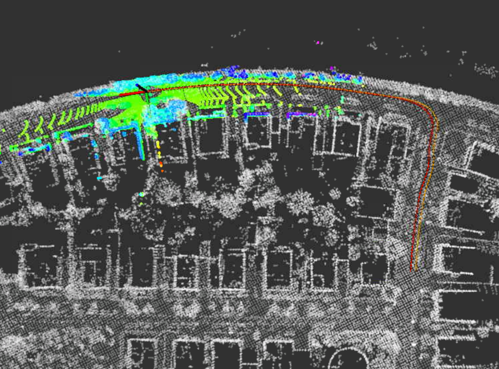

## 第4章作业说明文档

### 1 运行建图程序



### 2 运行点云匹配程序

采用**ScanContext**方法：



采用**GNSSPose**方法：



### 3 任意位置初始化

本次作业比较简单，只需要调用已经写好的函数接口并略作调整即可。修改内容如下：

```c++
////=========================================================////
////============= file in gnss_data.cpp =====================////
////=========================================================////
void GNSSData::InitOriginPosition() {
    latitude=48.9826437881;
    longitude=8.39044437232;
    altitude=116.395230664;
	// 数字尽量精确，这样才会减少误差
    // geo_converter.Reset(48.9827, 8.39046, 116.396);
    geo_converter.Reset(latitude, longitude, altitude);

    origin_longitude = longitude;
    origin_latitude = latitude;
    origin_altitude = altitude;

    // std::cout << "After GNSS Data: " << std::endl;
    // std::cout << "origin_longitude: " << origin_longitude << std::endl;
    // std::cout << "origin_latitude: " << origin_latitude << std::endl;
    // std::cout << "origin_altitude: " << origin_altitude << std::endl
    //           << std::endl;
    origin_position_inited = true;
}
////=========================================================////
////============= file in matching_flow.cpp =================////
////=========================================================////
bool MatchingFlow::UpdateMatching() {
    if (!matching_ptr_->HasInited()) {
        // TODO: implement global initialization here
        matching_ptr_->SetGNSSPose(current_gnss_data_.pose);
        //  matching_ptr_->SetScanContextPose(current_cloud_data_);

        // naive implementation:
        //Eigen::Matrix4f init_pose = Eigen::Matrix4f::Identity();
        //matching_ptr_->SetInitPose(init_pose);
        //matching_ptr_->SetInited();
    }

    return matching_ptr_->Update(current_cloud_data_, laser_odometry_);
}
```

效果：

`-s 100`：



`-s 200`：



`-s 300`：



`-s 400`：

