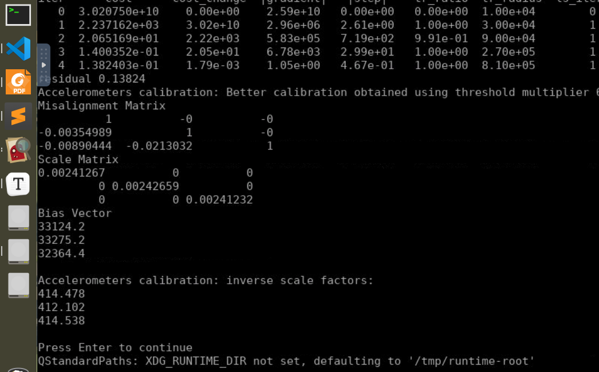
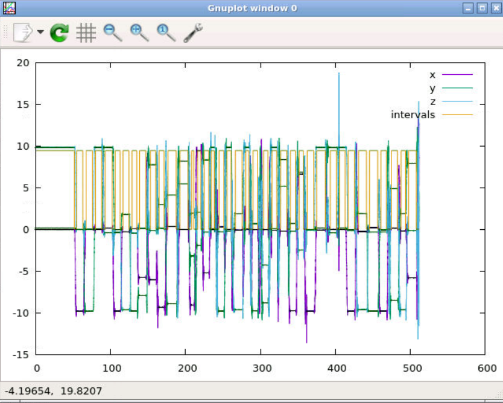
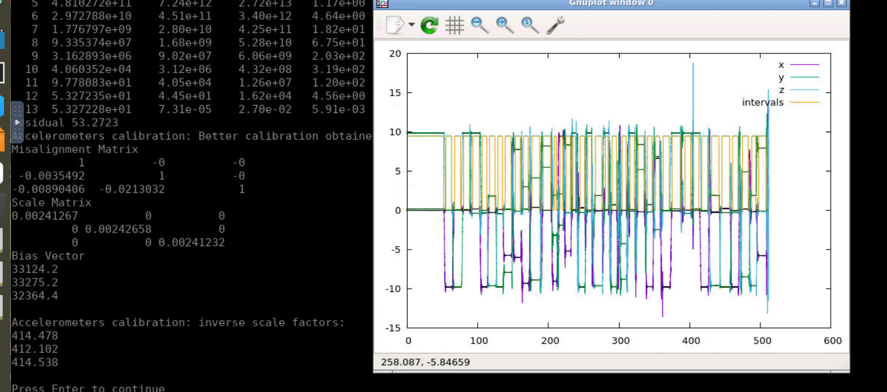

## Task 5 作业说明文档

根据助教老师建议，本课程笔记、作业均已经迁移至我的github上：[链接]()

### 1 公式推导

待优化变量为：
$$
\theta_{acc}^{'} = 
[S_{ayx}, S_{azx}, S_{azy}, K_{ax}^{'}, K_{ay}^{'}, K_{az}^{'}, b_{gx}, b_{gy}, b_{gz}]
$$
注意，为了便于表示和推导，这里采用的是$K^{'}_a = \frac{1}{K_a}$而非$K_a$本身。【后来发现不怎么麻烦就按原型推算了】

残差表示为一维标量：
$$
f(\theta_{acc}) = ||g||^2 - ||a||^2 = g_0^2 - a^{\top}a = g_0^2 - (a_x^2+a_y^2+a_z^2)
$$
其中，
$$
\begin{align}
a 	&= (1-S_a)K_a^{'}(A-b_g)\\
\begin{bmatrix} a_x \\ a_y \\ a_z \end{bmatrix} 
	&= 	\begin{bmatrix} 1 & 0 & 0 \\ -S_{ayx} & 1 & 0 \\ -S_{azx} & -S_{azy} & 1
		\end{bmatrix} 
		\begin{bmatrix} K_{ax}^{'} & 0 & 0\\ 0 & K_{ay}^{'} & 0\\ 0 & 0 & K_{az}^{'}
		\end{bmatrix}
		\begin{bmatrix} A_x-b_{gx} \\  A_y-b_{gy} \\  A_z-b_{gz} 
		\end{bmatrix}\\
	&=  \begin{bmatrix} 
		1 & 0 & 0 \\ -S_{ayx} & 1 & 0 \\ -S_{azx} & -S_{azy} & 1
		\end{bmatrix} 
		\begin{bmatrix} 
		K_{ax}^{'}(A_x-b_{gx}) \\  K_{ay}^{'}(A_y-b_{gy}) \\  K_{az}^{'}(A_z-b_{gz}) 
		\end{bmatrix}\\
	&=	\begin{bmatrix} 
			K_{ax}^{'}(A_x-b_{gx}) \\
            -S_{ayx}K_{ax}^{'}(A_x-b_{gx}) + K_{ay}^{'}(A_y-b_{gy}) \\  
            -S_{azx}K_{ax}^{'}(A_x-b_{gx}) - S_{azy}K_{ay}^{'}(A_y-b_{gy}) 
            	+ K_{az}^{'}(A_z-b_{gz}) \\
		\end{bmatrix}\\
\end{align}
$$
开始计算雅各比，首先确定维度为$1\times9$：
$$
\begin{align}
\frac{\partial f}{\partial S_{ayx}} &= 
	\frac{\partial (-a^2_y)}{\partial S_{ayx}} \\
		&= -2[-S_{ayx}K_{ax}^{'}(A_x-b_{gx}) + K_{ay}^{'}(A_y-b_{gy})]\cdot
			(-K_{ax}^{'}(A_x-b_{gx}))\\
		&= -2[K_{ax}^{'}(A_x-b_{gx})]^2S_{ayx} + 2 K_{ay}^{'}(A_y-b_{gy})\\
		&= -2[K_{ax}^{-1}(A_x-b_{gx})]^2S_{ayx} + 2 K_{ay}^{-1}K_{ax}^{-1}
			(A_y-b_{gy})(A_x-b_{gx})\\
\frac{\partial f}{\partial S_{azx}} &= 
	\frac{\partial (-a^2_z)}{\partial S_{azx}}  \\
		&= -2\left[ -S_{azx}K_{ax}^{'}(A_x-b_{gx}) - S_{azy}K_{ay}^{'}(A_y-b_{gy}) 
            	+ K_{az}^{'}(A_z-b_{gz}) \right] [-K_{ax}^{'}(A_x-b_{gx})]\\
        &= 2\left[ -S_{azx}K_{ax}^{-1}(A_x-b_{gx}) - S_{azy}K_{ay}^{-1}(A_y-b_{gy}) 
            	+ K_{az}^{-1}(A_z-b_{gz}) \right] [K_{ax}^{-1}(A_x-b_{gx})]\\
\frac{\partial f}{\partial S_{azy}} &= \frac{\partial (-a^2_z)}{\partial S_{azx}}  \\
		&= -2\left[ -S_{azx}K_{ax}^{'}(A_x-b_{gx}) - S_{azy}K_{ay}^{'}(A_y-b_{gy}) 
            	+ K_{az}^{'}(A_z-b_{gz}) \right] [-K_{ay}^{'}(A_y-b_{gy})]\\
		&= 2\left[ -S_{azx}K_{ax}^{-1}(A_x-b_{gx}) - S_{azy}K_{ay}^{-1}(A_y-b_{gy}) 
            	+ K_{az}^{-1}(A_z-b_{gz}) \right] [K_{ay}^{-1}(A_y-b_{gy})]\\
\frac{\partial f}{\partial K_{ax}} &= 
	\frac{\partial f}{\partial K_{ax}^{'}}
	\cdot\frac{\partial K_{ax}^{'}}{\partial K_{ax}}\\
	&= -[-2a_x\cdot(A_x-b_{gx}) 
		+2a_y\cdot S_{ayx}(A_x-b_{gx})
		+2a_z\cdot S_{azx}(A_x-b_{gx}) ]K_{ax}^{-2}\\
	&= 2(A_x-b_{gx})[a_x-a_yS_{ayx}-a_zS_{azx}]K_{ax}^{-2}\\
	
\frac{\partial f}{\partial K_{ay}} &=
	\frac{\partial f}{\partial K_{ay}^{'}}
	\cdot\frac{\partial K_{ay}^{'}}{\partial K_{ay}}\\
	&= 2[a_y\cdot(A_y-b_{gy}) - a_zS_{azy}\cdot(A_y-b_{gy}) ]K_{ay}^{-2}\\
	&= 2(A_y-b_{gy})[a_y-a_zS_{azy}]K_{ay}^{-2}\\
\frac{\partial f}{\partial K_{az}} &=
	\frac{\partial f}{\partial K_{az}^{'}}
	\cdot\frac{\partial K_{az}^{'}}{\partial K_{az}}\\
	&= 2[a_z\cdot(A_z-b_{gz}) ]K_{az}^{-2}\\
\frac{\partial f}{\partial b_{gx}} &= 
	2[a_x\cdot K_{ax}^{-1}-a_y\cdot S_{ayx}K_{ax}^{-1}-a_z\cdot S_{azx}K_{ax}^{-1}]\\
\frac{\partial f}{\partial b_{gy}} &= 
	2[a_y\cdot K_{ay}^{-1}-a_z\cdot S_{azy}K_{ay}^{-1}]\\
\frac{\partial f}{\partial b_{gz}} &= 
	2[a_z\cdot K_{az}^{-1}]
\end{align}
$$

事实上这么写有点麻烦（也懒得改了，latex太难打了），写程序时候容易眼花，所以在程序中用了很多中间变量，见第三题。

### 2 课程模型下标定程序结果

1. 修改内容：

   ```c++
   // TODO: 所有CalibratedTriad_都改为上三角，并修改参数模型
   /// ————————————————————MultiPosAccResidual—————————————————————— ///
   CalibratedTriad_<_T2> calib_triad(
           _T2(0), _T2(0), _T2(0),
           params[0], params[1], params[2],
           params[3], params[4], params[5],
           params[6], params[7], params[8]);
   
   /// ——————————————————————CalibratedTriad_——————————————————————— ///
     inline _T S_axy() const { return -mis_mat_(0, 1); };
     inline _T S_axz() const { return -mis_mat_(0, 2); };
     inline _T S_ayz() const { return -mis_mat_(1, 2); };
     inline _T S_ayx() const { return -mis_mat_(1, 0); };
     inline _T S_azx() const { return -mis_mat_(2, 0); };
     inline _T S_azy() const { return -mis_mat_(2, 1); };
   
     mis_mat_ <<  _T(1)   , -mis_yz  , -mis_zy  ,
                  -mis_xz ,  _T(1)   , -mis_zx  ,
                  -mis_xy , -mis_yx  ,  _T(1)   ;
   
   /// ————————————————————————calibrateAcc————————————————————————— ///
     // acc_calib_params[0] = init_acc_calib_.misYZ();
     // acc_calib_params[1] = init_acc_calib_.misZY();
     // acc_calib_params[2] = init_acc_calib_.misZX();
     acc_calib_params[0] = init_acc_calib_.S_ayx();
     acc_calib_params[1] = init_acc_calib_.S_azx();
     acc_calib_params[2] = init_acc_calib_.S_azy();
   
   /// ————————————————————————calibrateAcc————————————————————————— ///
     acc_calib_ = CalibratedTriad_<_T>(
         0, 0, 0,
         min_cost_calib_params[0],
         min_cost_calib_params[1],
         min_cost_calib_params[2],
   
         min_cost_calib_params[3],
         min_cost_calib_params[4],
         min_cost_calib_params[5],
         min_cost_calib_params[6],
         min_cost_calib_params[7],
         min_cost_calib_params[8]);
   ```

2. 结果展示





### 3 课程模型下解析求导

1. 代码展示

   ```c++
   template <typename _T>
   class AnalyticalMultiPosAccResidual : public ceres::SizedCostFunction<1, 9>
   {
   protected:
     const double g_mag_;
     const Eigen::Matrix<_T, 3, 1> sample_;
   
   public:
     AnalyticalMultiPosAccResidual(const _T &g_mag,
                                   const Eigen::Matrix<_T, 3, 1> &sample)
         : g_mag_((double)(g_mag)), sample_(sample){};
     ~AnalyticalMultiPosAccResidual(){};
   
     virtual bool Evaluate(double const *const *parameters,
                           double *residuals,
                           double **jacobians) const
     {
       Eigen::Map<const Eigen::Matrix<double, 1, 9> > params(parameters[0]);
       Eigen::Matrix<double, 3, 1> raw_samp(
           (double)(sample_(0)),
           (double)(sample_(1)),
           (double)(sample_(2)));
   
       CalibratedTriad_<double> calib_triad(
           0.0      , 0.0      , 0.0      ,
           params[0], params[1], params[2],
           params[3], params[4], params[5],
           params[6], params[7], params[8] );
   
       // apply undistortion transform:
       Eigen::Matrix<double, 3, 1> calib_samp = calib_triad.unbiasNormalize(raw_samp);
   
       residuals[0] = g_mag_ * g_mag_ - (calib_samp.transpose() * calib_samp)[0];
   
       double a_x = calib_samp[0];
       double a_y = calib_samp[1];
       double a_z = calib_samp[2];
       double S_yx = params[0];
       double S_zx = params[1];
       double S_zy = params[2];
       double K_x = params[3];
       double K_y = params[4];
       double K_z = params[5];
       double b_x = params[6];
       double b_y = params[7];
       double b_z = params[8];
       double A_x = raw_samp[0];
       double A_y = raw_samp[1];
       double A_z = raw_samp[2];
       double d_x = (A_x - b_x);
       double d_y = (A_y - b_y);
       double d_z = (A_z - b_z);
   
       if (jacobians != NULL && jacobians[0] != NULL)
       {
         jacobians[0][0] = 2 * a_y * K_x * d_x;
         jacobians[0][1] = 2 * a_z * K_x * d_x;
         jacobians[0][2] = 2 * a_z * K_y * d_y;
         jacobians[0][3] = 2 * d_x * ( -a_x + a_y * S_yx + a_z * S_zx );
         jacobians[0][4] = 2 * d_y * ( -a_y + a_z * S_zy);
         jacobians[0][5] = 2 * d_z * ( -a_z );
         jacobians[0][6] = 2 * K_x * ( a_x - a_y * S_yx - a_z * S_zx );
         jacobians[0][7] = 2 * K_y * ( a_y - a_z * S_zy );
         jacobians[0][8] = 2 * K_z * ( a_z );
       }
       return true;
     };
   };
   ```

2. 结果展示

   

