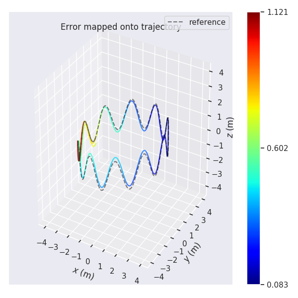
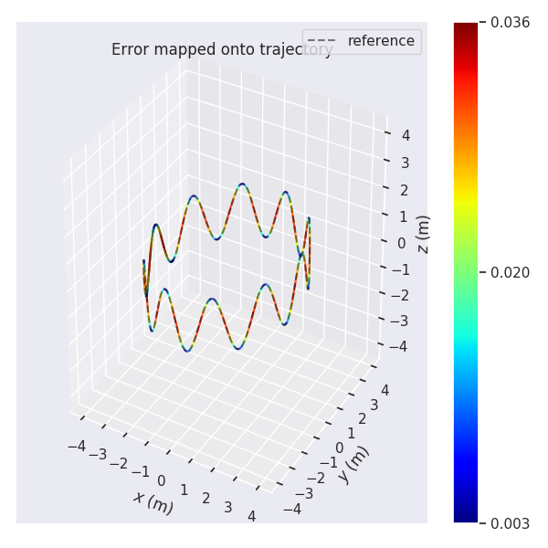
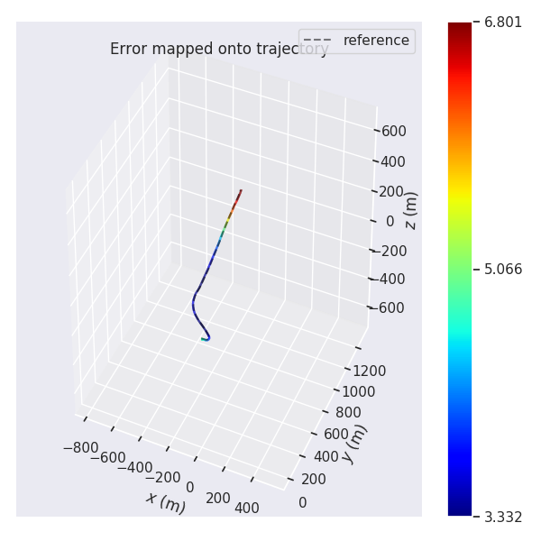

## Task 6 作业说明文档

根据助教老师建议，本课程笔记、作业均已经迁移至我的github上：[链接](https://github.com/ChenJiahao031008/sensor-fusion-for-slam)

另外由于最近比较忙，附加题暂时没有做，希望之后有时间补上。

### 1 中值法解算

算法实现：

```c++
        if (imu_data_buff_.size() < 2)
            return false;
        IMUData last_imu_data = imu_data_buff_[0];
        IMUData curr_imu_data = imu_data_buff_[1];
        Eigen::Vector3d w_k1 = last_imu_data.angular_velocity - angular_vel_bias_;
        Eigen::Vector3d w_k2 = curr_imu_data.angular_velocity - angular_vel_bias_;
        Eigen::Vector3d a_k1 = last_imu_data.linear_acceleration - linear_acc_bias_;
        Eigen::Vector3d a_k2 = curr_imu_data.linear_acceleration - linear_acc_bias_;
        double t_1 = last_imu_data.time;
        double t_2 = curr_imu_data.time;
#define Median

#ifdef Median
        Eigen::Vector3d Phi = (w_k1 + w_k2) / 2.0 * (t_2 - t_1);
        double phi = Phi.norm();

        // 旋转矩阵更新
        Eigen::Matrix3d Phi_x;
        Phi_x <<      0,    -Phi(2),    Phi(1),
                 Phi(2),          0,   -Phi(0),
                -Phi(1),     Phi(0),         0;
        Eigen::Matrix3d R_k12 = \
            Eigen::Matrix3d::Identity() + sin(phi) * 1.0 / phi * Phi_x \
            + (1 - cos(phi)) * 1.0 / (phi * phi) * Phi_x * Phi_x;

        Eigen::Matrix3d R_last = pose_.block<3, 3>(0, 0);
        Eigen::Matrix3d R_curr = R_last * R_k12;

        Eigen::Vector3d vel_last = vel_;
        vel_ += ((R_curr * a_k2 + R_last * a_k1) / 2.0 - G_) * (t_2 - t_1);

        // update position:
        Eigen::Vector3d t_last = pose_.block<3, 1>(0, 3);
        Eigen::Vector3d t_curr = t_last + vel_last * (t_2 - t_1) + 0.5 * ((R_curr * a_k2 + R_last * a_k1) / 2.0 - G_) * pow((t_2 - t_1), 2);

        // move forward --
        pose_.block<3, 3>(0, 0) = R_curr;
        pose_.block<3, 1>(0, 3) = t_curr;

        // NOTE: this is NOT fixed. you should update your buffer according to the method of your choice:
        imu_data_buff_.pop_front();
#endif

```

### 2 欧拉法解算

算法实现：

```c++
#ifdef Euler
        Eigen::Vector3d Phi = w_k1  * (t_2 - t_1);
        double phi = Phi.norm();

        Eigen::Matrix3d Phi_x;
        Phi_x << 0, -Phi(2), Phi(1),
                Phi(2), 0, -Phi(0),
                -Phi(1), Phi(0), 0;
        Eigen::Matrix3d R_k12 =
            Eigen::Matrix3d::Identity() + sin(phi) * 1.0 / phi * Phi_x + (1 - cos(phi)) * 1.0 / (phi * phi) * Phi_x * Phi_x;

        Eigen::Matrix3d R_last = pose_.block<3, 3>(0, 0);
        Eigen::Matrix3d R_curr = R_last * R_k12;

        Eigen::Vector3d vel_last = vel_;
        vel_ += (R_last * a_k1 - G_) * (t_2 - t_1);

        // update position:
        Eigen::Vector3d t_last = pose_.block<3, 1>(0, 3);
        Eigen::Vector3d t_curr = t_last + vel_last * (t_2 - t_1) + 0.5 * (R_last * a_k1 - G_) * pow((t_2 - t_1), 2);

        // move forward --
        pose_.block<3, 3>(0, 0) = R_curr;
        pose_.block<3, 1>(0, 3) = t_curr;

        // NOTE: this is NOT fixed. you should update your buffer according to the method of your choice:
        imu_data_buff_.pop_front();
#endif
```

效果对比：

+ 欧拉法：效果较差



+ 中值法：效果较好



### 3 仿真数据生成和对比

1. 命令调用：

   ```bash
   # 生成数据
   roslaunch gnss_ins_sim recorder_allan_variance_analysis.launch 
   # 播放数据
   rosbag play /workspace/data/gnss_ins_sim/allan_variance_analysis/data.bag
   # 估计方法
   roslaunch imu_integration imu_intergration_from_rosbag.launch
   ```

2. rosbag数据生成（代码）：

   ```python
    ## ——————————————————————get_gnss_ins_sim—————————————————————————— ##
       for i, (gyro, accel, ref_pos, ref_vel, ref_att_quat) in enumerate(
           zip(
               # a. gyro
               sim.dmgr.get_data_all('gyro').data[0],
               # b. accel
               sim.dmgr.get_data_all('accel').data[0],
               # c. ref pos:
               sim.dmgr.get_data_all('ref_pos').data,
               # d. ref vel:
               sim.dmgr.get_data_all('ref_vel').data,
               # e. ref quaternions
               sim.dmgr.get_data_all('ref_att_quat').data
           )
       ):
           yield {
               'stamp': i * step_size,
               'data': {
                   # a. gyro:
                   'gyro_x': gyro[0],
                   'gyro_y': gyro[1],
                   'gyro_z': gyro[2],
                   # b. accel:
                   'accel_x': accel[0],
                   'accel_y': accel[1],
                   'accel_z': accel[2],
                   # c. gyro:
                   'ref_pos_x': ref_pos[0],
                   'ref_pos_y': ref_pos[1],
                   'ref_pos_z': ref_pos[2],
                   # d. vel:
                   'ref_vel_x': ref_vel[0],
                   'ref_vel_y': ref_vel[1],
                   'ref_vel_z': ref_vel[2],
                   # e. ref quaternions:
                   'ref_att_quat_w': ref_att_quat[0],
                   'ref_att_quat_x': ref_att_quat[1],
                   'ref_att_quat_y': ref_att_quat[2],
                   'ref_att_quat_z': ref_att_quat[3]
               }
           }
    ## ——————————————————————gnss_ins_sim_recorder—————————————————————————— ##
   	with rosbag.Bag(
           os.path.join(rosbag_output_path, rosbag_output_name), 'w'
       ) as bag:
           # get timestamp base:
           timestamp_start = rospy.Time.now()
           init_flag = False
   
           for measurement in imu_simulator:
               # init:
               msg = Imu()
               # a. set header:
               msg.header.frame_id = 'ENU'
               msg.header.stamp = timestamp_start + rospy.Duration.from_sec(measurement['stamp'])
               # b. set orientation estimation:
               msg.orientation.x = measurement['data']['ref_att_quat_x']
               msg.orientation.y = measurement['data']['ref_att_quat_y']
               msg.orientation.z = measurement['data']['ref_att_quat_z']
               msg.orientation.w = measurement['data']['ref_att_quat_w']
               # c. gyro:
               msg.angular_velocity.x = measurement['data']['gyro_x']
               msg.angular_velocity.y = measurement['data']['gyro_y']
               msg.angular_velocity.z = measurement['data']['gyro_z']
               msg.linear_acceleration.x = measurement['data']['accel_x']
               msg.linear_acceleration.y = measurement['data']['accel_y']
               msg.linear_acceleration.z = measurement['data']['accel_z']
   
               # init:
               msg_gt = Odometry()
               # a. set header:
               msg_gt.header.frame_id = 'inertial'
               msg_gt.child_frame_id  = 'inertial'
               msg_gt.header.stamp =  timestamp_start + rospy.Duration.from_sec(measurement['stamp'])
               # b. set orientation estimation:
               msg_gt.pose.pose.orientation.x = measurement['data']['ref_att_quat_x']
               msg_gt.pose.pose.orientation.y = measurement['data']['ref_att_quat_y']
               msg_gt.pose.pose.orientation.z = measurement['data']['ref_att_quat_z']
               msg_gt.pose.pose.orientation.w = measurement['data']['ref_att_quat_w']
               # c. pos:
               if (init_flag==False):
                   x0 = measurement['data']["ref_pos_x"]
                   y0 = measurement['data']["ref_pos_y"]
                   z0 = measurement['data']["ref_pos_z"]
                   init_flag = True
               msg_gt.pose.pose.position.x = measurement['data']['ref_pos_x'] - x0
               msg_gt.pose.pose.position.y = measurement['data']['ref_pos_y'] - y0
               msg_gt.pose.pose.position.z = measurement['data']['ref_pos_z'] - z0
               # print( measurement['data'])
   
               # d. vel:
               msg_gt.twist.twist.linear.x = measurement['data']['ref_vel_x']
               msg_gt.twist.twist.linear.y = measurement['data']['ref_vel_y']
               msg_gt.twist.twist.linear.z = measurement['data']['ref_vel_z']
   
               # write:
               bag.write(topic_name_imu, msg, msg.header.stamp)
               bag.write(topic_name_pos, msg_gt, msg_gt.header.stamp)
   ```

3. 数据记录（代码）：

   ```c++
   bool Activity::PublishPose() {
       // a. set header:
       message_odom_.header.stamp = ros::Time::now();
       message_odom_.header.frame_id = odom_config_.frame_id;
   
       // b. set child frame id:
       message_odom_.child_frame_id = odom_config_.frame_id;
   
       // b. set orientation:
       Eigen::Quaterniond q(pose_.block<3, 3>(0, 0));
       q.normalized();
       message_odom_.pose.pose.orientation.x = q.x();
       message_odom_.pose.pose.orientation.y = q.y();
       message_odom_.pose.pose.orientation.z = q.z();
       message_odom_.pose.pose.orientation.w = q.w();
   
       // c. set position:
       Eigen::Vector3d t = pose_.block<3, 1>(0, 3);
       message_odom_.pose.pose.position.x = t.x();
       message_odom_.pose.pose.position.y = t.y();
       message_odom_.pose.pose.position.z = t.z();
   
       // d. set velocity:
       message_odom_.twist.twist.linear.x = vel_.x();
       message_odom_.twist.twist.linear.y = vel_.y();
       message_odom_.twist.twist.linear.z = vel_.z();
   
       odom_estimation_pub_.publish(message_odom_);
   
       // e. record imu data
       std::ofstream OutEM(estimate_file.c_str(), std::ios::app);
       if (OutEM.is_open())
       {
           OutEM << message_odom_.header.stamp << " " << t.x() << " " << t.y() << " " << t.z() << " " << q.x() << " " << q.y() << " " << q.z() << " " << q.w() << std::endl;
           OutEM.close();
       }
       std::cout << odom_data_buff_.size() << std::endl;
       if (odom_data_buff_.size() < 1)
           return false;
   
       OdomData odom_data = odom_data_buff_[0];
       std::cout<< odom_data.pose << std::endl;
       Eigen::Matrix4d pose_gt = odom_data.pose;
       Eigen::Matrix3d R_gt = pose_gt.block<3, 3>(0, 0);
       Eigen::Quaterniond q_gt(R_gt);
       q_gt.normalized();
       Eigen::Vector3d t_gt = pose_gt.block<3, 1>(0, 3);
       std::ofstream OutGT(ground_truth_file.c_str(), std::ios::app);
       if (OutGT.is_open())
       {
           OutGT << message_odom_.header.stamp << " " << t_gt.x() << " " << t_gt.y() << " " << t_gt.z() << " " << q_gt.x() << " " << q_gt.y() << " " << q_gt.z() << " " << q_gt.w() << std::endl;
           OutGT.close();
       }
       odom_data_buff_.pop_front();
   
       return true;
   }
   ```

4. 对比

   详细的结果存放与`/result/`文件夹：

   

