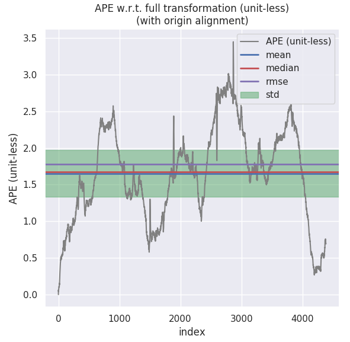

## Task 7 作业说明文档

根据助教老师建议，本课程笔记、作业均已经迁移至我的github上：[链接](https://github.com/ChenJiahao031008/sensor-fusion-for-slam)

[TOC]

### 1 ESKF 代码

由于代码修改地方比较多，可能比较乱，完整的代码还是请助教老师移步github。

算法实现：

```c++
//_____________________________________________________________________________//
void ErrorStateKalmanFilter::UpdateOdomEstimation(
    Eigen::Vector3d &linear_acc_mid, Eigen::Vector3d &angular_vel_mid) {
  //
  // TODO: this is one possible solution to previous chapter, IMU Navigation,
  // assignment
  //
  int index_curr = 1;
  int index_prev = 0;
  Eigen::Vector3d angular_delta;
  GetAngularDelta(index_curr, index_prev, angular_delta, angular_vel_mid);
  Eigen::Matrix3d R_curr, R_prev;
  // update orientation:
  UpdateOrientation(angular_delta, R_curr, R_prev);

  // get velocity delta:
  double delta_t = 0.0;
  Eigen::Vector3d vel_delta;
  GetVelocityDelta(index_curr, index_prev, R_curr, R_prev, delta_t, vel_delta, linear_acc_mid);

  // save mid-value unbiased linear acc for error-state update:

  // update position:
  UpdatePosition(delta_t, vel_delta);
//_____________________________________________________________________________//
void ErrorStateKalmanFilter::SetProcessEquation(const Eigen::Matrix3d &C_nb,
                                                const Eigen::Vector3d &f_n,
                                                const Eigen::Vector3d &w_b)
{
  // TODO: set process / system equation:
  // a. set process equation for delta vel:
  Eigen::Matrix3d a_x, w_x;
  a_x <<       0, -f_n(2),   f_n(1),
          f_n(2),       0,  -f_n(0),
         -f_n(1),  f_n(0),        0;
  w_x <<       0, -w_b(2),   w_b(1),
          w_b(2),       0,  -w_b(0),
         -w_b(1),  w_b(0),        0;
  F_.block<3, 3>(kIndexErrorVel, kIndexErrorOri)   = -C_nb * a_x;
  F_.block<3, 3>(kIndexErrorVel, kIndexErrorAccel) = -C_nb;
  B_.block<3, 3>(kIndexErrorVel, kIndexNoiseAccel) =  C_nb;

  // b. set process equation for delta ori:
  F_.block<3, 3>(kIndexErrorOri, kIndexErrorOri)   = -w_x;
}
  
//_____________________________________________________________________________//
void ErrorStateKalmanFilter::UpdateErrorEstimation(
    const double &T, const Eigen::Vector3d &linear_acc_mid,
    const Eigen::Vector3d &angular_vel_mid) {
  static MatrixF F_1st;
  static MatrixF F_2nd;
  static MatrixB B_1st;
  // TODO: update process equation:
  UpdateProcessEquation(linear_acc_mid, angular_vel_mid);

  // TODO: get discretized process equations:
  Eigen::Matrix<double, kDimState, kDimState> I_15 = Eigen::Matrix<double, kDimState, kDimState>::Identity();

  F_1st = I_15 + T * F_;
  B_1st = B_;
  B_1st.block<3, 3>(kIndexErrorVel, kIndexNoiseAccel) *= T;
  B_1st.block<3, 3>(kIndexErrorOri, kIndexNoiseGyro ) *= T;
  B_1st.block<3, 3>(kIndexErrorAccel, kIndexNoiseBiasAccel) *= sqrt(T);
  B_1st.block<3, 3>(kIndexErrorGyro , kIndexNoiseBiasGyro ) *= sqrt(T);

  // TODO: perform Kalman prediction
  // 这里采用了一阶泰勒展开，和PPT保持一致
  X_ = F_1st * X_;
  P_ = F_1st * P_ * F_1st.transpose() + B_1st * Q_ * B_1st.transpose();
}
//_____________________________________________________________________________//
void ErrorStateKalmanFilter::CorrectErrorEstimationPose(
    const Eigen::Matrix4d &T_nb, Eigen::VectorXd &Y, Eigen::MatrixXd &G,
    Eigen::MatrixXd &K) {
  //
  // TODO: set measurement:
  //
  YPose_.block<3, 1>(0, 0) = pose_.block<3, 1>(0, 3) - T_nb.block<3, 1>(0, 3);
  Eigen::Matrix3d measPose = T_nb.block<3, 3>(0, 0);
  Eigen::Matrix3d predPose = pose_.block<3, 3>(0, 0);
  Eigen::Matrix3d deltaPose = measPose.transpose() * predPose;
  Eigen::Matrix3d R_tmp = deltaPose - Eigen::Matrix3d::Identity();
  Eigen::Vector3d deltaTheta(R_tmp(2, 1), R_tmp(0, 2), R_tmp(1, 0));
  YPose_.block<3, 1>(3, 0) = deltaTheta;

  // TODO: set measurement equation:
  Y = YPose_;
  G = GPose_;

  // TODO: set Kalman gain:
  K = P_ * GPose_.transpose() * (GPose_ * P_ * (GPose_.transpose()) + CPose_ * RPose_ * CPose_.transpose()).inverse();
}
//_____________________________________________________________________________//
void ErrorStateKalmanFilter::CorrectErrorEstimation(
    const MeasurementType &measurement_type, const Measurement &measurement) {
  //
  // TODO: understand ESKF correct workflow
  //
  Eigen::VectorXd Y;
  Eigen::MatrixXd G, K;
  switch (measurement_type) {
  case MeasurementType::POSE:
    CorrectErrorEstimationPose(measurement.T_nb, Y, G, K);
    break;
  default:
    break;
  }

  // TODO: perform Kalman correct:
  P_ = (MatrixP::Identity() - K * G) * P_;
  X_ = X_ + K * (Y - G * X_);
}    
//_____________________________________________________________________________//
void ErrorStateKalmanFilter::EliminateError(void) {
  //
  // TODO: correct state estimation using the state of ESKF
  //
  // a. position:
  pose_.block<3, 1>(0, 3) -= X_.block<3, 1>(0, 0);
  // b. velocity:
  vel_ -= X_.block<3, 1>(3, 0);
  // c. orientation: 
  // 原始方法，顺便也修改了getOdometry函数
  Eigen::Matrix3d delta_R = 
      Eigen::Matrix3d::Identity() - Sophus::SO3d::hat(X_.block<3, 1>(kIndexErrorOri, 0)).matrix();
  Eigen::Quaterniond dq = Eigen::Quaterniond(delta_R);
  dq = dq.normalized();
  // 这里通过实验来看，做归一化效果相差不大。
  pose_.block<3, 3>(0, 0) = pose_.block<3, 3>(0, 0) * dq.toRotationMatrix();
  // 和同学讨论后认为由于delta为小量，因此下面这种方法也行
  // Eigen::Matrix3d C_nn =
  //     Sophus::SO3d::exp(X_.block<3, 1>(kIndexErrorOri, 0)).matrix();
  // pose_.block<3, 3>(0, 0) = pose_.block<3, 3>(0, 0) * C_nn.transpose();

  // d. gyro bias:
  if (IsCovStable(kIndexErrorGyro)) {
    gyro_bias_ += X_.block<3, 1>(kIndexErrorGyro, 0);
  }

  // e. accel bias:
  if (IsCovStable(kIndexErrorAccel)) {
    accl_bias_ += X_.block<3, 1>(kIndexErrorAccel, 0);
  }
}    
//_____________________________________________________________________________//    
```

### 2 ESKF 调参相关

本节包含了第2小题和第3小题的第二部分。

效果对比：

1. 不同组别的参数

   | 组别 | process    |            |            |            | measure    |            |            |            |
   | ---- | ---------- | ---------- | ---------- | ---------- | ---------- | ---------- | ---------- | ---------- |
   |      | gyro       | accel      | bias_accel | bias_gyro  | pose.pos   | pose.ori   | pos        | vel        |
   | 01   | 1.0e-4     | 2.5e-3     | 2.5e-3     | 1.0e-4     | 1.0e-4     | 1.0e-4     | 1.0e-4     | 2.5e-3     |
   | 02   | 1.0e-4     | 2.5e-3     | 2.5e-3     | 1.0e-4     | **1.0e-3** | **1.0e-3** | **1.0e-3** | **2.5e-2** |
   | 03   | **1.0e-3** | **2.5e-2** | **2.5e-2** | **1.0e-3** | 1.0e-4     | 1.0e-4     | 1.0e-4     | 2.5e-3     |
   | 04   | **1.0e-3** | **2.5e-2** | **2.5e-2** | **1.0e-3** | **1.0e-3** | **1.0e-3** | **1.0e-3** | **2.5e-2** |
   | 05   | **1.0e-5** | **2.5e-4** | **2.5e-3** | **1.0e-4** | **1.0e-3** | **1.0e-3** | **1.0e-3** | **2.5e-2** |
   | 06   | **1.0e-3** | **2.5e-2** | 2.5e-3     | 1.0e-4     | **1.0e-3** | **1.0e-3** | **1.0e-3** | **2.5e-2** |

   说明：

   + 第一组为原始数据；第二组降低了观测数据的置信度但是预测置信度不变；第三组降低了预测的置信度但是观测不变；第四组同时降低观测和预测的置信度；第五组降低观测的置信度的同时提高预测的置信度；**第六组为调整后的最佳方案**。这里的置信度以方差形式表示，置信度越高，方差越小。

2. 不同参数的效果（**原点对齐情况下**）

   | 组别 | 类型   | mean         | median       | rmse         | std          |
   | ---- | ------ | ------------ | ------------ | ------------ | ------------ |
   | 01   | laser  | 1.652944     | 1.676267     | 1.774544     | 0.645588     |
   |      | fusion | 0.431222     | 0.396760     | 0.480277     | 0.211456     |
   | 02   | laser  | 1.615714     | 1.684239     | 1.733467     | 0.627993     |
   |      | fusion | 1.165015     | 1.122245     | 1.208327     | 0.320615     |
   | 03   | laser  | 1.616814     | 1.684996     | 1.734258     | 0.627345     |
   |      | fusion | 1.065636     | 1.025562     | 1.133271     | 0.385647     |
   | 04   | laser  | 1.652951     | 1.677799     | 1.774777     | 0.646209     |
   |      | fusion | 0.432124     | 0.400023     | 0.481191     | 0.211693     |
   | 05   | laser  | 1.616031     | 1.684507     | 1.733610     | 0.627573     |
   |      | fusion | 3.657941     | 3.177020     | 4.342306     | 2.339890     |
   | 06   | laser  | 1.653379     | 1.676406     | 1.775098     | 0.645994     |
   |      | fusion | **0.417310** | **0.382127** | **0.465205** | **0.205592** |
   
   说明：
   
   + 上述结果**经过原点对齐处理**，未经过原点对齐的数据和雷达数据差距不大，很难评判。**使用是否原点对齐的得到的结果差别很大，不清楚是其中的原理和正确性**，但是直观上理解对齐原点更加符合基于地图先验进行重定位的处理。
   
   + 比较上述数据可以看出，**雷达的方差较小，IMU方差较大的时候精度相对较高**。这是因为在有地图先验的情况下雷达的数据相对较为精准，IMU则由于噪声存在精度稍差，因此我们更加信任雷达的数据而非IMU的数据。IMU存在的价值还在于平滑数据，是误差波动不是那么大。
   
   + 关于IMU融合后如何对效果进行评估这一问题，和陈梓杰同学还有老师讨论了一下。一开始梓杰提出可以看z轴，因为z轴尺度变化不大，因而可以从曲线上看出变化趋势，这里附上我的z轴数据：
   
     
   
     可以看出，经过滤波后的数据比原始的激光数据**更加平滑**，**且具有一定的滞后表现**，与我个人的理解一致；但是老师认为只看z轴是不准确也不全面的，还是应该看每个位姿对应的ape误差曲线：
   
     
   
     
   
     表面看上去好像波动更大了，但是主要是因为尺度变化的问题，其实波动更小。

### 3 Bias为零时ESKF变化

公式推导十分简单，在$F_t$保持不变的情况下，$B_t$和$B_{k-1}$修正为：
$$
\begin{aligned}
B_t &= \begin{bmatrix}
0 & 0 & 0 & 0 \\
R_t & 0 & 0 & 0 \\
0 & I & 0 & 0 \\
0 & 0 & 0 & 0 \\
0 & 0 & 0 & 0
\end{bmatrix}\\
B_{k-1} &=  \begin{bmatrix}
0 & 0 & 0 & 0 \\
R_{k-1}T & 0 & 0 & 0 \\
0 & I_3T & 0 & 0 \\
0 & 0 & 0 & 0 \\
0 & 0 & 0 & 0
\end{bmatrix}
\end{aligned}
$$
程序实现中只需要将B矩阵修正即可。

程序实现：

```c++
// #define USE_BIAS
#ifdef USE_BIAS
  B_.block<3, 3>(kIndexErrorAccel, kIndexNoiseBiasAccel) = Eigen::Matrix3d::Identity();
  B_.block<3, 3>(kIndexErrorGyro, kIndexNoiseBiasGyro) = Eigen::Matrix3d::Identity();
#endif
```

结果对比：

1. 无BIAS：

   > laser：APE w.r.t. full transformation (unit-less) (with origin alignment)
   >
   >        max	3.453187
   >       mean	1.615563
   >     median	1.684069
   >        min	0.000001
   >       rmse	1.733801
   >        sse	13178.599154
   >        std	0.629305
   >
   > fusion：APE w.r.t. full transformation (unit-less) (with origin alignment)
   >
   >        max	2.212439
   >       mean	1.043594
   >     median	1.035000
   >        min	0.000002
   >       rmse	1.114647
   >        sse	5446.848862
   >        std	0.391598

2. 有BIAS：

   > laser：APE w.r.t. full transformation (unit-less) (with origin alignment)
   >
   >        max	3.448671
   >       mean	1.653331
   >     median	1.676544
   >        min	0.000002
   >       rmse	1.775060
   >        sse	13822.720555
   >        std	0.646014
   >
   > fusion：APE w.r.t. full transformation (unit-less) (with origin alignment)
   >
   >        max	1.318459
   >       mean	0.432820
   >     median	0.400146
   >        min	0.000002
   >       rmse	0.482476
   >        sse	1021.219529
   >        std	0.213189


