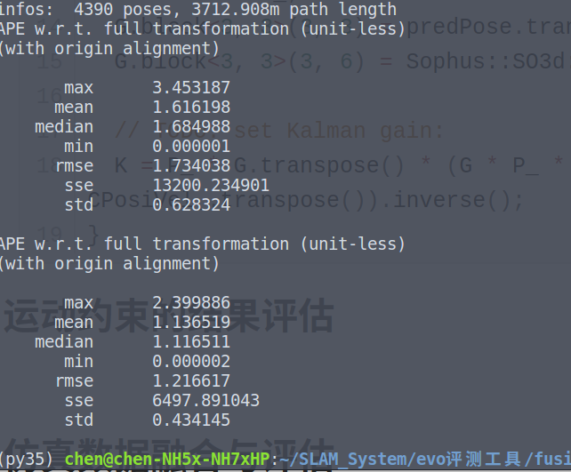
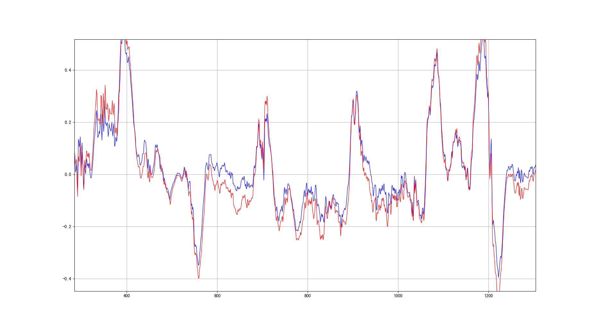
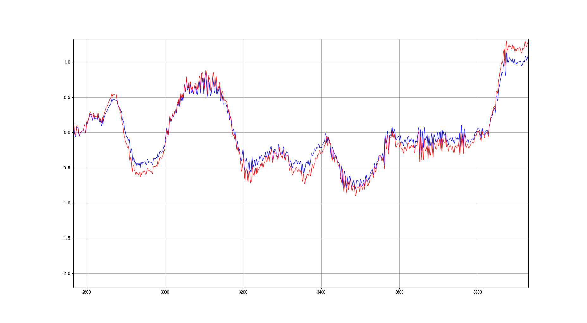
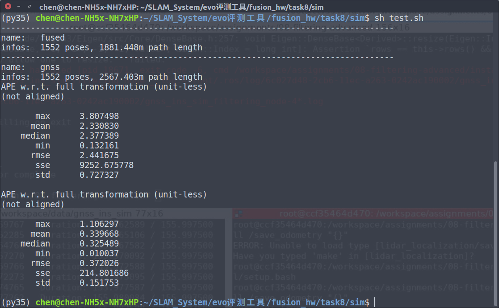
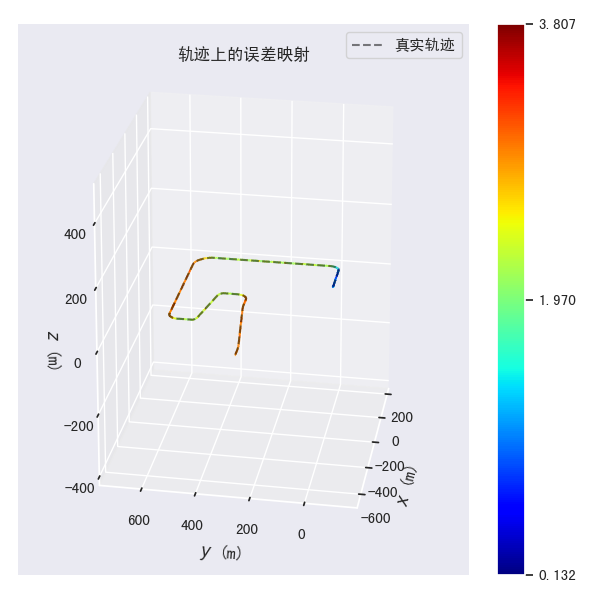
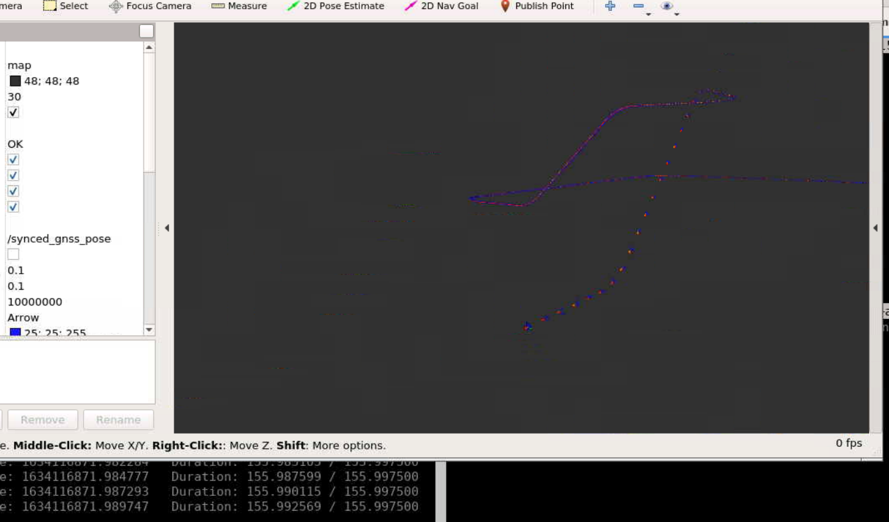

## Task 8 作业说明文档

根据助教老师建议，本课程笔记、作业均已经迁移至我的github上：[链接](https://github.com/ChenJiahao031008/sensor-fusion-for-slam)

[TOC]

### 1 实现运动约束模型

运动约束模型：考虑到KITTI中没有编码器相关数据，因此只对y和z方向进行约束。注意，和PPT中的表示方法不同，为了方便处理，速度将作为第三类观测量置于角度之后，而不是和PPT之中放在位置和角度之间。

首先进行观测初始化：

```c++
RPoseWithMC_.block<3, 3>(0, 0) = COV.MEASUREMENT.POSE.POSI * Eigen::Matrix3d::Identity();
RPoseWithMC_.block<3, 3>(3, 3) = COV.MEASUREMENT.POSE.ORI * Eigen::Matrix3d::Identity();
RPoseWithMC_.block<2, 2>(6, 6) = COV.MEASUREMENT.VEL * Eigen::Matrix2d::Identity();

GPoseWithMC_.block<3, 3>(0, kIndexErrorPos) = Eigen::Matrix3d::Identity();
GPoseWithMC_.block<3, 3>(3, kIndexErrorOri) = Eigen::Matrix3d::Identity();
CPoseWithMC_.block<3, 3>(0, 0) = Eigen::Matrix3d::Identity();
CPoseWithMC_.block<3, 3>(3, 3) = Eigen::Matrix3d::Identity();
CPoseWithMC_.block<2, 2>(6, 6) = Eigen::Matrix2d::Identity();

QPoseWithMC_.block<kDimMeasurementPoseWithMC, kDimState>(0, 0) = GPoseWithMC_;
```

矫正不同的误差模型：

1. 姿态模型：和上一章节一致，不再赘述。

2. 姿态-速度模型：

   ```c++
   void ErrorStateKalmanFilter::CorrectErrorEstimationPoseVel(
       const Eigen::Matrix4d &T_nb, const Eigen::Vector3d &v_b, const Eigen::Vector3d &w_b,
       Eigen::VectorXd &Y, Eigen::MatrixXd &G, Eigen::MatrixXd &K
   ) {
   
     Eigen::Matrix3d measPose = T_nb.block<3, 3>(0, 0);
     Eigen::Matrix3d predPose = pose_.block<3, 3>(0, 0);
     Eigen::Matrix3d deltaPose = measPose.transpose() * predPose;
     Eigen::Matrix3d R_tmp = deltaPose - Eigen::Matrix3d::Identity();
     Eigen::Vector3d deltaTheta(R_tmp(2, 1), R_tmp(0, 2), R_tmp(1, 0));
     Eigen::Vector3d v_b_pred(v_b.norm(), 0.0, 0.0);
   
     // 预测-观测：
     YPoseVel_.block<3, 1>(0, 0) = pose_.block<3, 1>(0, 3) - T_nb.block<3, 1>(0, 3);
     YPoseVel_.block<3, 1>(3, 0) = deltaTheta;
     YPoseVel_.block<3, 1>(6, 0) = (predPose.transpose() * vel_ - v_b_pred);
   
     // TODO: set measurement equation:
     Y = YPoseVel_;
     G = GPoseVel_;
     G.block<3, 3>(6, 3) = predPose.transpose();
     G.block<3, 3>(6, 6) = Sophus::SO3d::hat(v_b_pred).matrix();
   
     // TODO: set Kalman gain:
     K = P_ * G.transpose() * (G * P_ * (G.transpose()) + CPoseVel_ * RPoseVel_ * CPoseVel_.transpose()).inverse();
   }
   ```

3. 姿态-运动约束模型：

   ```c++
   void ErrorStateKalmanFilter::CorrectErrorEstimationPoseWithMC(
       const Eigen::Matrix4d &T_nb, const Eigen::Vector3d &v_b, const Eigen::Vector3d &w_b,
       Eigen::VectorXd &Y, Eigen::MatrixXd &G, Eigen::MatrixXd &K)
   {
   
     Eigen::Matrix3d measPose = T_nb.block<3, 3>(0, 0);
     Eigen::Matrix3d predPose = pose_.block<3, 3>(0, 0);
     Eigen::Matrix3d deltaPose = measPose.transpose() * predPose;
     Eigen::Matrix3d R_tmp = deltaPose - Eigen::Matrix3d::Identity();
     Eigen::Vector3d deltaTheta(R_tmp(2, 1), R_tmp(0, 2), R_tmp(1, 0));
     // 预测-观测：位移->角度->速度
     YPoseWithMC_.block<3, 1>(0, 0) = pose_.block<3, 1>(0, 3) - T_nb.block<3, 1>(0, 3);
     YPoseWithMC_.block<3, 1>(3, 0) = deltaTheta;
     Eigen::Vector3d v_b_pred(v_b.norm(), 0.0, 0.0);
     // std::cout << predPose.transpose() * vel_ << std::endl;
     YPoseWithMC_.block<2, 1>(6, 0) = (predPose.transpose() * vel_ - v_b_pred).block<2, 1>(1, 0);
   
     // TODO: set measurement equation:
     Y = YPoseWithMC_;
     G = GPoseWithMC_;
     // Rbw = Rbn = predPose.transpose()
     G.block<2, 3>(6, 3) = (predPose.transpose()).block<2, 3>(1, 0);
     G.block<2, 3>(6, 6) = (Sophus::SO3d::hat(v_b).matrix()).block<2, 3>(1, 0);
   
     // TODO: set Kalman gain:
     K = P_ * G.transpose() * (G * P_ * (G.transpose()) + CPoseWithMC_ * RPoseWithMC_ * CPoseWithMC_.transpose()).inverse();
   }
   ```

### 2 运动约束的结果评估



对于body系下y轴和z轴的速度波动曲线，自建绘图工具进行可视化：

```python
import numpy as np
import os
import matplotlib as mlp
import matplotlib.pyplot as plt

file_name_1 = "./MC.txt"
file_name_2 = "./NMC.txt"

vel_y_1 = []
vel_z_1 = []
vel_y_2 = []
vel_z_2 = []


## ________________读取文件________________ ##
file1 = open(file_name_1, 'r')
for line in file1.readlines():
    line = line.strip('\n')        # 除去换行
    line = line.split(' ')         # 文件以“ ”分隔
    if "" in line:                 # 解决每行结尾有空格的问题
        line.remove("")
    # print(line[0], line[1], line[2])
    vel_y_1.append(float(line[1]))
    vel_z_1.append(float(line[2]))

file2 = open(file_name_2, 'r')
for line in file2.readlines():
    line = line.strip('\n')        # 除去换行
    line = line.split(' ')         # 文件以“ ”分隔
    if "" in line:                 # 解决每行结尾有空格的问题
        line.remove("")
    # print(line[0], line[1], line[2])
    vel_y_2.append(float(line[1]))
    vel_z_2.append(float(line[2]))

# print(vel_y)
## ________________绘制图片________________ ##
num = min(len(vel_y_1), len(vel_y_2))
# print(num)
idx = [i for i in range(num)]

vel_y_1 = vel_y_1[0:num]
vel_y_2 = vel_y_2[0:num]
vel_z_1 = vel_z_1[0:num]
vel_z_2 = vel_z_2[0:num]
plt.figure(1)
plt.plot(idx,vel_y_1, color="blue",linewidth=1.0,linestyle="-",label="vel_y_1",alpha=0.9)    # 颜色 线宽 类型 标签 透明度
plt.plot(idx,vel_y_2, color="red",linewidth=1.0,linestyle="-",label="vel_y_2",alpha=0.9)    # 颜色 线宽 类型 标签 透明度
# plt.plot(idx,vel_z_1, color="blue", linewidth=1.0,linestyle="-",label="vel_z",alpha=0.9)    # 颜色 线宽 类型 标签 透明度
# plt.plot(idx,vel_z_2, color="red", linewidth=1.0,linestyle="-",label="vel_z",alpha=0.9)    # 颜色 线宽 类型 标签 透明度
# plt.legend(loc="upper left") # 图例
plt.grid() # 网格线
plt.show()

```

结果如下：





### 3 仿真数据融合与评估

位置-速度模型：

```c++
void ErrorStateKalmanFilter::CorrectErrorEstimationPosiVel(
    const Eigen::Matrix4d &T_nb, const Eigen::Vector3d &v_b, const Eigen::Vector3d &w_b,
    Eigen::VectorXd &Y, Eigen::MatrixXd &G, Eigen::MatrixXd &K
) {
  Eigen::Matrix3d predPose = pose_.block<3, 3>(0, 0);
  Eigen::Vector3d v_b_pred(v_b.norm(), 0.0, 0.0);
  // 预测-观测：位移->速度
  YPosiVel_.block<3, 1>(0, 0) = pose_.block<3, 1>(0, 3) - T_nb.block<3, 1>(0, 3);
  YPosiVel_.block<3, 1>(3, 0) = predPose.transpose() * vel_ - v_b_pred;

  // TODO: set measurement equation:
  Y = YPosiVel_;
  G = GPosiVel_;
  G.block<3, 3>(3, 3) = predPose.transpose();
  G.block<3, 3>(3, 6) = Sophus::SO3d::hat(v_b).matrix();

  // TODO: set Kalman gain:
  K = P_ * G.transpose() * (G * P_ * (G.transpose()) + CPosiVel_ * RPosiVel_ * CPosiVel_.transpose()).inverse();
}
```

对yaml配置进行调整：

1. 更改经纬度
2. 更改经纬度所在地的重力大小

效果：






