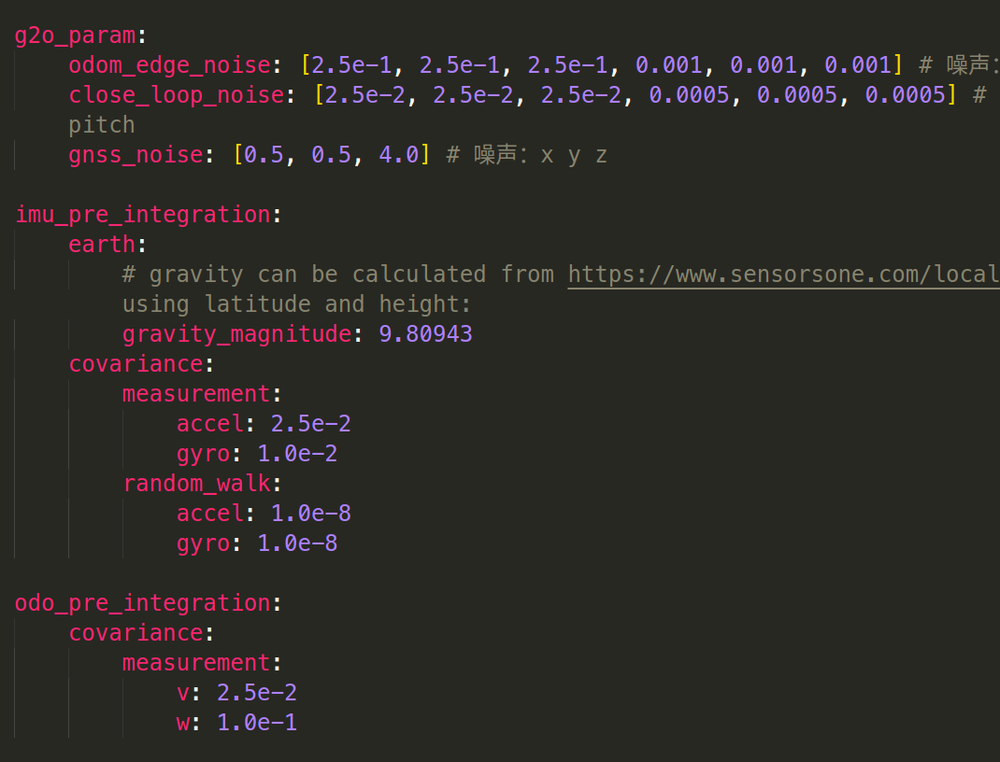
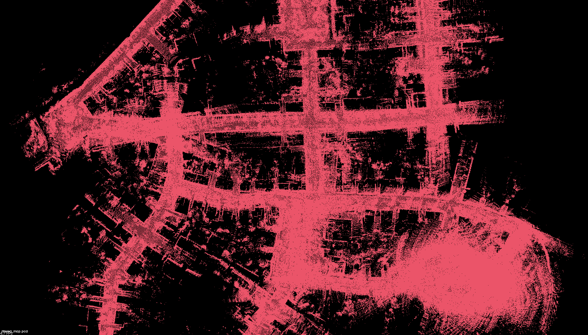
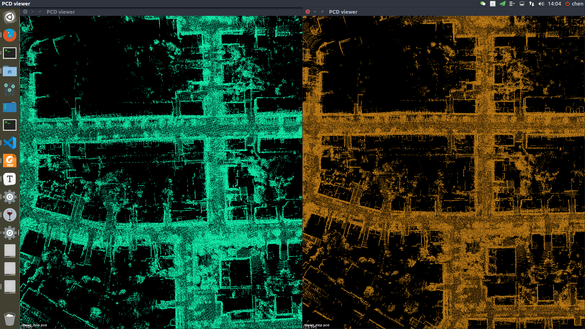
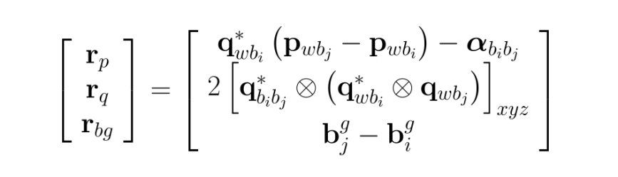

## Task 9 作业说明文档

根据助教老师建议，本课程笔记、作业均已经迁移至我的github上：[链接](https://github.com/ChenJiahao031008/sensor-fusion-for-slam)

[TOC]

### 1 代码补全

1. **代码错误纠正**：在`lio_back_end.cpp`中的`SaveOptimizedPose`函数，激光里程计的值和GNSS的值记录反了，修正如下

   ```c++
     for (size_t i = 0; i < optimized_key_frames_.size(); ++i) {
           // a. ground truth, IMU/GNSS:
           current_pose = key_gnss_deque_.at(i).pose;
           // current_pose = key_frames_deque_.at(i).pose;
           current_pose(2, 3) = 0.0f;
           SavePose(ground_truth_ofs_, current_pose);
           // b. lidar odometry:
           // current_pose = key_gnss_deque_.at(i).pose;
           current_pose = key_frames_deque_.at(i).pose;
           current_pose(2, 3) = 0.0f;
           SavePose(laser_odom_ofs_, current_pose);
           // c. optimized odometry:
           current_pose = optimized_key_frames_.at(i).pose;
           current_pose(2, 3) = 0.0f;
           SavePose(optimized_pose_ofs_, current_pose);
       }
   ```

2. 方差传递矩阵计算和推导：

   ```c++
   // 1. get w_mid:
   w_mid = (prev_w + curr_w) / 2.0;
   // 2. update relative orientation, so3:
   prev_theta_ij = state.theta_ij_;
   // 相当于四元数 [1, 0.5 * w_mid * T]
   d_theta_ij = Sophus::SO3d::exp(w_mid * T);
   curr_theta_ij = state.theta_ij_ = prev_theta_ij * d_theta_ij;
   
   // 3. get a_mid: 这里无需减去重力加速度
   a_mid = (prev_theta_ij * prev_a + curr_theta_ij * curr_a) / 2.0;
   
   // 4. update relative translation:
   state.alpha_ij_ += state.beta_ij_ * T + 0.5 * a_mid * T * T;
   
   // 5. update relative velocity:
   state.beta_ij_ += a_mid * T;
   
   // 1. intermediate results:
   prev_R = prev_theta_ij.matrix();
   curr_R = curr_theta_ij.matrix();
   prev_R_a_hat = prev_R * Sophus::SO3d::hat(prev_a);
   curr_R_a_hat = curr_R * Sophus::SO3d::hat(curr_a);
   
   // 2. set up F:
   MatrixF F = F_;
   double T_3 = T * T * T;
   double T_2 = T * T;
   F.block<3, 3>(INDEX_ALPHA, INDEX_THETA) = -0.25 * T_2 * (prev_R_a_hat + curr_R_a_hat * (Eigen::Matrix3d::Identity() - T * Sophus::SO3d::hat(w_mid))); //f12
   F.block<3, 3>(INDEX_BETA,  INDEX_THETA) = -0.50 * T   * (prev_R_a_hat + curr_R_a_hat * (Eigen::Matrix3d::Identity() - T * Sophus::SO3d::hat(w_mid))); //f32
   F.block<3, 3>(INDEX_ALPHA, INDEX_BETA)  = Eigen::Matrix3d::Identity() * T; //f13
   F.block<3, 3>(INDEX_ALPHA, INDEX_B_A) = -0.25 * (prev_R + curr_R) * T_2;   //f14
   // 讲义有问题，没有 state.b_g_i_;
   F.block<3, 3>(INDEX_ALPHA, INDEX_B_G) = 0.25 * T_3 * curr_R_a_hat; //f15
   F.block<3, 3>(INDEX_THETA, INDEX_THETA) = Eigen::Matrix3d::Identity() - T * Sophus::SO3d::hat(w_mid); //f22
   F.block<3, 3>(INDEX_THETA, INDEX_B_G) = -Eigen::Matrix3d::Identity() * T; //f25
   F.block<3, 3>(INDEX_BETA,  INDEX_B_A) = -0.50 * (prev_R + curr_R) * T; //f34
   F.block<3, 3>(INDEX_BETA,  INDEX_B_G) = 0.5 * T_2 * curr_R_a_hat; //f35
   
   // 3. set up G:
   MatrixB B = B_ ;
   B.block<3, 3>(INDEX_ALPHA, INDEX_M_ACC_PREV) =  0.25 * T_2 * prev_R; //g11
   B.block<3, 3>(INDEX_BETA,  INDEX_M_ACC_PREV) =  0.50 * T   * prev_R; //g31
   B.block<3, 3>(3, 3) = 0.5 * Eigen::Matrix3d::Identity() * T; //g22
   B.block<3, 3>(3, 9) = 0.5 * Eigen::Matrix3d::Identity() * T; //g24
   B.block<3, 3>(INDEX_ALPHA, INDEX_M_GYR_PREV) = -0.125 * T_3 * curr_R_a_hat; //g12
   B.block<3, 3>(INDEX_BETA,  INDEX_M_GYR_PREV) = -0.250 * T_2 * curr_R_a_hat; //g32
   B.block<3, 3>(INDEX_ALPHA, INDEX_M_ACC_CURR) =  0.250 * T_2 * curr_R; //g13
   B.block<3, 3>(INDEX_BETA,  INDEX_M_ACC_CURR) =  0.500 * T   * curr_R; //g33
   B.block<3, 3>(INDEX_ALPHA, INDEX_M_GYR_CURR) = -0.125 * T_3 * curr_R_a_hat; //g14
   B.block<3, 3>(INDEX_BETA,  INDEX_M_GYR_CURR) = -0.250 * T_2 * curr_R_a_hat; //g34
   
   // 4. update P_:
   P_ = F * P_ * F.transpose() + B * Q_ * B.transpose();
   
   // 5. update Jacobian:
   // 注意这里的Jacobian并不是观测的雅各比，这是增量的变换量，用于预积分的叠加
   J_ = F * J_;
   ```

3. 顶点的增量形式：

   ```c++
   virtual void oplusImpl(const double *update) override {
       // TODO: do update
       // 首先进行类别转换
       PRVAG deltaX(update);
       _estimate.pos += deltaX.pos;
       _estimate.vel += deltaX.vel;
       _estimate.b_a += deltaX.b_a;
       _estimate.b_g += deltaX.b_g;
       // 角度例外(应该是右乘？)
       _estimate.ori = _estimate.ori * deltaX.ori;
       updateDeltaBiases(deltaX.b_a, deltaX.b_g);
   }
   ```

4. 预积分的观测约束（边）：

   ```c++
   // TODO: update pre-integration measurement caused by bias change:
   // 更新顶点带来的关于偏置的变化量(为什么放前面不妨后面，但想想好像无所谓)
   if (v0->isUpdated())
   {
       Eigen::Vector3d delta_b_a_i, delta_b_g_i;
       // 从顶点中获取delta
       v0->getDeltaBiases(delta_b_a_i, delta_b_g_i);
       // 利用公式更新delta
       updateMeasurement(delta_b_a_i, delta_b_g_i);
   }
   
   // TODO: compute error:
   const Eigen::Vector3d &alpha_ij = _measurement.block<3, 1>(INDEX_P, 0);
   const Eigen::Vector3d &theta_ij = _measurement.block<3, 1>(INDEX_R, 0);
   const Eigen::Vector3d &beta_ij  = _measurement.block<3, 1>(INDEX_V, 0);
   
   _error.block<3, 1>(INDEX_P, 0) = ori_i.inverse() * (pos_j - pos_i - vel_i * T_ + 0.5 * g_ * T_ * T_) - alpha_ij;
   _error.block<3, 1>(INDEX_R, 0) = (Sophus::SO3d::exp(theta_ij).inverse() * ori_i.inverse() * ori_j).log();
   _error.block<3, 1>(INDEX_V, 0) = ori_i.inverse() * (vel_j - vel_i + g_ * T_) - beta_ij;
   _error.block<3, 1>(INDEX_A, 0) = b_a_j - b_a_i;
   _error.block<3, 1>(INDEX_G, 0) = b_g_j - b_g_i;
   ```

### 2 IMU效果分析

1. **实验环境**

   实验将分为4组，分别为：

   + 原始参数下的联合优化，记为*RES-RAW*
   + 调整参数后的联合优化，记为*RES-MOD*
   + 调整参数后不带IMU的联合优化，记为*RES-noIMU*
   + 调整参数后不带IMU和里程计的联合优化，记为*RES-noIMU-noODM*

   调整后的参数表示为：

   

   调整参数的总体思路为：*增大IMU方差，减小闭环方差和GNSS方差*

2. **实验对比**

   注意：实验中尽管雷达数据（LASER）不完全一致，但是极为相似，为了便于比较，使用一组数据代替全部。

   + 轨迹评估

   | Method/Assessment | APE-RMSE     | APE-MEDIAN   | APE-STD      |
   | ----------------- | ------------ | ------------ | ------------ |
   | LASER             | 6.488785     | 4.405505     | 3.760307     |
   | RES-RAW           | 0.941997     | 0.690510     | 0.486237     |
   | RES-MOD           | 0.447959     | 0.345238     | 0.225031     |
   | RES-noIMU         | 0.317163     | 0.230903     | 0.173035     |
   | RES-noIMU-noODM   | **0.093151** | **0.038917** | **0.066902** |

   + 地图质量评估：

     + RES-RAW与RES-noIMU对比：RES-noIMU弱于RES-noIMU，有明显的重影。

       

     + RES-MOD与RES-noIMU对比：相差不大，RES-MOD可能在z轴上表现略好一点

       

3. **实验分析**

   可以看出去掉IMU效果轨迹精度反而变好了，建图质量也没有太大的损失。这个是有点反直觉的，我个人以为其中的原因主要在于参数的调整上面，直觉上认为，由于用GNSS作为真值，GNSS又参与联合优化，那么其他传感器的权重越大，越会影响到最终的优化结果，这也表明了调整参数后的联合优化和不带IMU的联合优化差距不大。

### 3 IMU融合里程计的推导计算

由于推导过程$\LaTeX$ 打起来太麻烦，因此只写出结论（其实和基于IMU的差别不大）。注意：下述操作均不考虑轮式里程计（速度）的偏差。

1. 离散状态下的预积分量：
   $$
   \begin{align}
   q_{b_i b_k+1} &= 
   q_{b_i b_k} \otimes \begin{bmatrix} 1 \\ \frac{1}{2} \omega^{b} \delta t \end{bmatrix} \\
   \alpha_{b_i b_k+1} &= \alpha_{b_i b_k} + v^{w} \delta t\\
   \omega^{b} &= \frac{1}{2}\left[\left(\omega^{b_k}-b^g\right) + \left(\omega^{b_{k+1}}-b^g\right)\right] \\
   v^w &= \frac{1}{2}\left(v^{b_k}+ v^{b_{k+1}}\right) \\
   \end{align}
   $$

2. 构建残差：

   

3. 方差的传递

   + 离散下递推关系：

   $$
   \begin{align*}
   \delta\alpha_{k+1} &= \delta \alpha_{k}+ \frac{1}{2}(v_{w_{k+1}} + v_{w_{k}}) \delta t + \frac{\delta t}{2}n^{v}_k + \frac{\delta t}{2}n^{v}_{k+1} \\
   
   \delta\theta_{k+1} &= [I - [\frac{\omega^{b_k} + \omega^{b_{k+1}}}{2}- b_{\omega k}]_{\times} \delta t ] \delta \theta_k + \frac{\delta t}{2}n_{\omega_k} + \frac{\delta t}{2}n_{\omega_{k+1}} - \delta b_{\omega_k} \delta t  \\
   
   \delta b^g_{k+1} &= \delta b^g_{k}+ n^g_{b_k}\delta t\\
   
   \end{align*}
   $$

   + 构成递推式：
     $$
     \begin{bmatrix}
     \delta\alpha_{k+1} \\ \delta\theta_{k+1} \\ \delta b^g_{k+1}
     \end{bmatrix} = \textbf{F}_{3\times3} 
     \begin{bmatrix}
     \delta\alpha_{k} \\ \delta\theta_{k} \\ \delta b^g_{k}
     \end{bmatrix} + \textbf{B}_{3\times5}  \begin{bmatrix}
     n^v_k \\ n^g_k \\ n^v_{k+1} \\ n^g_{k+1} \\ n^g_{b_k}
     \end{bmatrix}
     $$

   + 其中各参数变量为：
     $$
     \begin{align*}
     f_{11} &= \textbf{I},\quad f_{12} = f_{13} = 0 \\
     f_{21} &= 0\\
     f_{22} &= \textbf{I}- [w]_{\times}\delta t \\
     f_{23} &= -\textbf{I} \delta t\\
     f_{31} &= f_{32} = 0 \\
     f_{33} &= \textbf{I} \\
     b_{11} &= b_{13} = \textbf{I} \\
     b_{12} &= b_{14} = b_{15} = 0 \\
     b_{22} &= b_{24} = \frac{1}{2}\textbf{I}\delta t \\
     b_{21} &= b_{23} = b_{25} = 0 \\
     b_{31} &= b_{32} = b_{33} = b_{34} = 0 \\
     b_{35} &= \textbf{I}\delta t
     \end{align*}
     $$

4. 残差对状态量雅可比：

   对i时刻的变量求解：
   $$
   \begin{align*}
   \frac{\partial r_p}{\partial \delta p_{b_i b_i^{'}} }&= -R_{wb_i}^{T}\\
   \frac{\partial r_p}{\partial \delta \theta_{b_i b_i^{'}}} &=[R_{wb_i}^{T}(p_{wb_j} - p_{wb_i} )]_{\times}\\
   \frac{\partial r_p}{\partial \delta b_i^g} &= - J_{b_i^g}^{\alpha}\\
   
   \frac{\partial r_q }{\partial \delta p_{b_i b_i^{'}}} &= 0\\
   \frac{\partial r_q }{\partial \delta \theta_{b_i b_i^{'}}} &= -2 \begin{bmatrix} 0 & I \end{bmatrix} [q_{w b_j}^{-1} \otimes q_{w b_I}]_{L}[q_{b_i b_j}]_{R} \begin{bmatrix} 0 \\ \frac{1}{2}I \end{bmatrix}\\
   \frac{\partial r_q}{\partial \delta b_i^g} &= -2 \begin{bmatrix} 0 & I \end{bmatrix}[q_{w b_j}^{*} \otimes q_{w b_i} \otimes q_{b_i b_j}]_L \begin{bmatrix} 0 \\ \frac{1}{2} J_{b_i^g}^q \end{bmatrix}\\
   
   \frac{\partial r_{bg}}{\partial \delta p_{b_i b_i^{'}}} &= 0\\
   \frac{\partial r_{bg}}{\partial \delta \theta_{b_i b_i^{'}}} &= 0\\
   \frac{\partial r_{bg}}{\partial \delta b_i^g} &= -I\\
   
   \end{align*}
   $$
   对 j 时刻求解：
   $$
   \begin{align*}
   \frac{\partial r_p}{\partial \delta p_{b_j b_j^{'}} }&= R_{wb_i}^{T}\\
   \frac{\partial r_p}{\partial \delta \theta_{b_j b_j^{'}}} &= 0\\
   \frac{\partial r_p}{\partial \delta b_j^g} &= - J_{b_i^g}^{\alpha}\\
   
   \frac{\partial r_q }{\partial \delta p_{b_j b_j^{'}}} &= 0\\
   \frac{\partial r_q }{\partial \delta \theta_{b_j b_j^{'}}} &= -2 \begin{bmatrix} 0 & I \end{bmatrix} [q_{b_i b_j}^{-1} \otimes q_{w b_i}^{-1} \otimes q_{w b_j}  ]_{L} \begin{bmatrix} 0 \\ \frac{1}{2}I \end{bmatrix}\\
   \frac{\partial r_q}{\partial \delta b_j^g} &= 0\\
   
   \frac{\partial r_{bg}}{\partial \delta p_{b_j b_j^{'}}} &= 0\\
   \frac{\partial r_{bg}}{\partial \delta \theta_{b_j b_j^{'}}} &= 0\\
   \frac{\partial r_{bg}}{\partial \delta b_j^g} &= I\\
   
   \end{align*}
   $$

5. bias变化后更新：
   $$
   \begin{align}
   \alpha_{b_i b_j} &= \alpha_{b_i b_j} + J^{\alpha}_{b_i^g} \delta b_i^g \\
   q_{b_i b_j} &= q_{b_i b_j} \otimes \begin{bmatrix} 1 \\ \frac{1}{2} J_{b_i^g}^q \delta b_i^g \end{bmatrix}
   \end{align}
   $$


