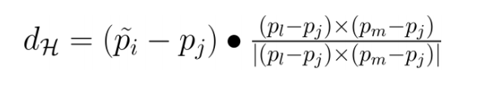
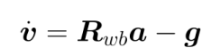
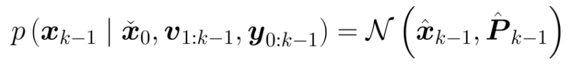

## 多传感器融合课程学习笔记

[TOC]

### 第一章：环境构建和概述

#### 1 docker相关

1. docker管理工具：[Portainer](https://www.jianshu.com/p/6234ffaf7203)

2. 安装及配置：详见课程相关的ReadMe文档

3. 常用命令：

   ```bash
   # docker启动       
   systemctl start docker
   service docker start
   # 重启docker服务
   systemctl restart  docker
   sudo service docker restart
   # 关闭docker    
   systemctl stop docker
   service docker stop
   # 查看是否启动成功
   docker ps -a
   ```

### 第2章：3D激光里程计（一）

#### 1 直接匹配：ICP方法

1. 推导SVD分解中的理解：
   + 第15页PPT推导出等价于最大化$\text{Trace}(RH)$；第16页证明了存在正定阵$AA^T$，对于任意一个正交矩阵$B$，有$\text{Trace}(AA^T)\ge\text{Trace}(BAA^T)$，但其中有两个点没有详细说明：
   + 为什么$RH$一定是正定矩阵：==这一点尚不清楚==
   + 为什么16页中公式中各个符号在ICP中代表了什么：由旋转矩阵的定义得知，旋转矩阵是一个行列式为1的正交矩阵，因此，对于其他变化$R^{'}$，$\text{Trace}(RH)\ge\text{Trace}(R^{'}RH)$。
2. 其他解法：参考[文献](https://igl.ethz.ch/projects/ARAP/svd_rot.pdf)，个人更加偏好这种思路，规避了之前16页公式的证明。

#### 2 ICP系列汇总

1. 点云预处理：均匀采样，随机采样，法空间采样（目的是更多的去除平面等纹理稀疏地方的点（很容易出现病态等问题），而非边、角等纹理密集区域的点）
2. loss模型：点到点（ICP，但是不能保证每次采样一致性），点到线（PLICP，共线模型），点到面，面到面
3. 求解方法：SVD方法，迭代优化方法
4. 增加鲁棒性：NICP

#### 3 直接匹配：NDT方法

1. NDT核心：采用基于概率的栅格方法求解联合概率分布
2. 雅各比公式推导：采用旋转角而非李代数形式，不是不行，而是与现有公开资料保持一致。

#### 4 NDT系列汇总

1. 点云预处理：均匀采样，随机采样，法空间采样
2. 栅格策略：固定尺寸栅格，八叉树（栅格尺寸不固定），聚类后取栅格（去除离散点，节约计算量）
3. 增加鲁棒性：三线插值（解决格子切分带来的不连续，但是需要具体问题具体分析）

#### 5 点云畸变补偿

1. 产生：机械雷达分帧（转一圈有一帧，因此可以帧与帧之间匹配，但是转圈有时间）
2. **优点**： 有足够数量的点云才能进行匹配，且一周正好是周围环境的完整采集。
   **缺点**： 每个激光点的坐标都是相对于雷达的，雷达运动时，不同激光点的坐标原点会不同
3. 畸变类型：
   + 平移带来的畸变：扫描标准圆为螺旋线
   + 旋转带来的畸变：扫描标准圆为缺口圆
4. 补偿方法：
   + 角速度和线速度输入： 可以使用imu、 编码器等外接传感器，一般情况下，imu测量角速度，轮式里程计测量线速度
   + 由于激光畸变原理是在2D平面上产生的，因此z轴不参与畸变矫正

### 第3章：3D激光里程计（二）

#### 1 点线面几何基础

1. 向量计算及微分性质
   $$
   \frac{\partial a\cdot b}{\partial a} = b 
   $$
   
   $$
   \frac{\partial a^\wedge{}b}{\partial a} = 
   -\frac{\partial b^\wedge{}a}{\partial a} = -b^\wedge{}
   $$
   
   $$
   a^\wedge{}b = -b^\wedge{}a
   $$
   
2. 点到直线的距离模型：

   
   $$
   d = |\vec{AD}| = \frac{|\vec{AB}\times\vec{AC}|}{|\vec{BC}|}
   $$

   + 叉乘的模$|\vec{AB}\times\vec{AC}|$表示构成平行四边形的面积
   + 总体思路是平行四边形面积除以对角线长度

3. 点到平面的距离模型：

   
   $$
   \vec{n}= \frac{\vec{BC}\times\vec{BD}}{|\vec{BC}\times\vec{BD}|}\\
   d = |\vec{AE}| = \vec{AB} \cdot \vec{n}
   $$

   + 公式中$\vec{n}$为平面的单位法向量
   + 点乘$a\cdot b$的结果等价于向量a到向量b上投影的长度

#### 2 点线面特征提取

1. 按线数分割（**仅限于点云中不包含所在线数的信息情况下**）

   + 该束激光相比于雷达水平面的倾角：$\omega = \arctan(\frac{z}{\sqrt{x^2+y^2}})$
   + 根据倾角和雷达内参(各扫描线的设计倾角)，可知雷达属于哪条激光束。

2. 计算简化曲率（下述公式采用程序实际做法）

   + 对于多线激光雷达来说，计算曲率 c是分别针对单个线进行的。

   + 参考[博客](https://blog.csdn.net/robinvista/article/details/104379087)
   
   + 曲率计算公式：
     $$
     c = \frac{1}{||X||}||\sum_i{(X-X_i)}||_{xyz}^2
     $$
     
   + 曲率计算含义：根据前后各5个点与当前点的长度(长度指激光点到雷达的距离)，计算曲率大小，表现平面的弯曲程度。当c趋近于0时，近似平面。
   
3.  按曲率大小筛选特征点

   + 共分4类：曲率特别大的点(sharp)，曲率不太大的点(less_sharp)，曲率不太小的点(less_flat)，曲率特别小的点(flat)【曲率从大到小排序】
   + 实际使用时：
     + sharp 为”点到直线“中的“点”；
     + sharp 和 less_sharp 为 “点到直线”中的直线；
     + flat 为“点到平面”中的“点”；
     + flat 和 less flat 为 “点到平面”中的”平面“

#### 3 基于线面特征的位姿变化 

1. 帧间关联

   + 线特征关联：当$p_i$为sharp 时，在上一帧中搜索离点最近的线特征点，并在上一帧的相邻线上再找一个线特征点，组成直线。
     + **注意，这里的线指的是竖直的线**
   + 面特征关联：当$p_i$为flat 时，在上一帧中搜索离点最近的面特征点，并在相邻线上找两个面特征点，组成平面。

2. 残差函数：即**点到线、面的距离**函数

   + 其中，代码中点到直线距离采用的矢量形式，理论上$f^Tf$后是无差别的

   + 线特征的残差函数：

     

   + 面特征残差函数：

     

3. 雅各比矩阵：

   + 线特征的雅各比矩阵
     $$
     J_{\xi} = \frac{\partial{d_\xi}}{\partial T} 
     = \frac{\partial{d_\xi}}{\partial p_i}\cdot \frac{\partial{p_i}}{\partial T}
     $$
     其中：(详细推导见14讲)
     $$
     \begin{align}
     &\frac{\partial{p_i}}{\partial t} = I\\
     &\frac{\partial{p_i}}{\partial R} = -(Rp_i+t)^{\wedge}\\
     \end{align}
     $$
     对于$\frac{\partial{d_\xi}}{\partial p_i}$，有：
     $$
     \begin{align}
     \frac{\partial{d_\xi}}{\partial \tilde{p_i}} = &\frac{1}{|p_a-p_b|}\cdot
     	(\frac{
     		\partial{(\tilde{p_i}-p_b)^{\wedge}(\tilde{p_i}-p_a)}
     	}{\partial(\tilde{p_i}-p_a)}\cdot 
     	\frac{\tilde{p_i}-p_a}{\partial\tilde{p_i}}
         - 
     	\frac{
     		\partial{(\tilde{p_i}-p_a)^{\wedge}(\tilde{p_i}-p_b)}
     	}{\partial({\tilde{p_i}-p_b})}\cdot 
     	\frac{\tilde{p_i}-p_b}{\partial\tilde{p_i}})\\
     
     =&\frac{1}{|p_a-p_b|}\cdot
     	((\tilde{p_i}-p_b)^{\wedge}-(\tilde{p_i}-p_a)^{\wedge})\\
     =& \frac{(p_a-p_b)^{\wedge}}{|p_a-p_b|}
     	
     \end{align}
     $$
     其中，(10) 到 (11) 为公式 (2) 推导，公式 (11) 到 (12) 表示反对称矩阵可以内部加减。

   + 面特征的雅各比矩阵：
     $$
     \begin{align}
     J_\xi = \frac{\partial{d_{\mathcal{H}}} }{\partial T} &= 
     	\frac{\partial{d_{\mathcal{H}}}}{\partial \tilde{p_i}} \cdot
     	\frac{\partial{\tilde{p_i}}}{\partial T}
     \end{align}
     $$
     其中，令
     $$
     X = (\tilde{p_i}-p_j)\cdot\frac{(p_l-p_j)\times(p_m-p_j)}{|(p_l-p_j)\times(p_m-p_j)|}
     $$
     

     有：
     $$
     \frac{\partial{d_{\mathcal{H}}}}{\partial \tilde{p_i}} = 
     \frac{\partial|X|}{\partial \tilde{p_i}} = 
     \frac{\partial|X|}{\partial X} \cdot
     \frac{\partial X}{\partial \tilde{p_i}} =
     \frac{X}{|X|}\cdot\frac{\partial X}{\partial \tilde{p_i}} \\
     \frac{\partial X}{\partial \tilde{p_i}} =
     \frac{(p_l-p_j)\times(p_m-p_j)}{|(p_l-p_j)\times(p_m-p_j)|}
     $$
     物理意义上，它代表的是平面的单位法向量。

#### 4 基于特征的里程计实现

1. 整体框图：

   

2. 框图关键点理解和分析：

   + **帧与帧的匹配 vs 帧与模型的匹配**：由于雷达信息的分辨率不高，在远处获得的特征往往不稳定，特征也比较稀疏，往往难以匹配。因此一个好的想法是建立一个map，将多帧雷达信息融合起来做匹配，这样的特征就足够稠密
   + **两种模型的混合使用**：帧到模型的匹配耗时较大，因此往往每隔几帧才进行一次以保证实时性。
   + **LOAM的老式地图管理策略**：（这部分在之后不再使用）老式管理策略不区分帧的来源，将所有帧的雷达信息融合在一起，这带来两个问题，一是无法使用之前帧与帧之前匹配策略，不过它给出了基于主方向的解决思路；第二个问题是这种老式策略在之后被抛弃的主要原因，假如我第10帧时候发现之前第5帧的数据不对，想要调整，但是这时候由于数据都是混合在一起的，因此无法单独分离出来。

### 第四章：点云地图构建及基于地图的定位

#### 1 回环检测

1. 作用：
   + 有了RTK还需要回环检测吗？需要。RTK得到的结果尽管很高，但是仍然有厘米级别的误差，如果在一条路上重复，可能会造成两次误差相加，造成分米级别的误差，用回环检测还是很有必要的。
2. 分类：
   + 有初始相对位姿：ICP，NDT系列
   + 无初始相对位姿：
     + 非学习方法：[scan context](https://github.com/irapkaist/scancontext)，[特征直方图](https://github.com/hku-mars/loam_livox)
     + 基于学习方法：segmap，PointNetVLAD

#### 2 后端优化

1. 结构组成：

   

2. 后端优化基本原理：

   + 观测：
     + 连续两帧的相对位姿观测；
     + 回环匹配得到的相对位姿观测；
     + 组合导航提供的先验位姿观测。
   + 使用方式：
     + 1)和2)的观测构成了基于回环的位姿修正；（在没有GPS的情况下使用）
     + 1)和3)的观测构成了基于先验观测的位姿修正；（不用回环，不推荐）
     + 1) 2) 3) 也可以同时使用。（推荐）

3. 李群、李代数基本知识：参考PPT

4. **基于回环的位姿修正**

   + 误差项：
     $$
     e_{ij} = \ln(T_{ij}^{-1}T_i^{-1}T_j) = \ln(\exp(-\xi_{ij}^{\wedge})\exp(-\xi_{i}^{\wedge})\exp(\xi_{j}^{\wedge}))
     $$
   + 雅各比矩阵：
     $$
     \begin{align}
     	\hat{e_{ij}} =&  \ln(T_{ij}^{-1} T_i^{-1}
     	\exp((-\delta\xi_i)^{\wedge})
     	\exp(\xi_j^{\wedge}) T_j )^{\vee}\\
     =&\ \ln\left(T_{ij}^{-1} T_i^{-1}
     	\exp\left((-\delta\xi_i)^{\wedge}\right) T_j 
     	\exp\left((\text{Ad}(T_j^{-1})\xi_j)^{\wedge}\right)\right)^{\vee}\\
     =&\ \ln\left(T_{ij}^{-1} T_i^{-1} T_j 
     	\exp\left((-\text{Ad}(T_j^{-1})\delta\xi_i)^{\wedge}\right) 
     	\exp\left((\text{Ad}(T_j^{-1})\delta\xi_j)^{\wedge}\right)\right)^{\vee}\\
     =&\ \ln\left(T_{ij}^{-1} T_i^{-1} T_j 
     	\exp\left((-\text{Ad}(T_j^{-1})\delta\xi_i)^{\wedge}
     	+ (\text{Ad}(T_j^{-1})\delta\xi_j)^{\wedge}\right)\right)^{\vee}\\
     =&\ \ln\left(\exp(e_{ij}) 
     	\exp\left((-\text{Ad}(T_j^{-1})\delta\xi_i)^{\wedge}
     	+ (\text{Ad}(T_j^{-1})\delta\xi_j)^{\wedge}\right)\right)^{\vee}\\
     \thickapprox& \ e_{ij}
     	-\mathcal{J}^{-1}_r(e_{ij}) \text{Ad}(T_j^{-1})\delta\xi_i
     	+\mathcal{J}_r^{-1}(e_{ij}) \text{Ad}(T_j^{-1})\delta\xi_i\\
     	
     A_{ij} 
     =&\ \frac{\partial e_{ij}}{\partial \delta\xi_i} 
     = -\mathcal{J}^{-1}_r(e_{ij}) \text{Ad}(T_j^{-1})\\
     
     B_{ij} 
     =&\ \frac{\partial e_{ij}}{\partial \delta\xi_j} 
     = \mathcal{J}^{-1}_r(e_{ij}) \text{Ad}(T_j^{-1})\\
     
     \mathcal{J}^{-1}_r(e_{ij}) \thickapprox&\ I + \frac{1}{2}
     	\begin{bmatrix}
     	\phi_e^{\wedge} & \rho_e^{\wedge} \\ 0 & \phi_e^{\wedge}
     	\end{bmatrix}
     \end{align}
     $$

   + 公式18,19采用李代数的伴随性质；公式20采用微小变换下BCH公式，公式21表示非微小变化下BCH公式

5. **基于先验观测的位姿修正**

   + 

#### 3 点云地图的创立


#### 4 基于地图的定位

1. 在地图匹配中，鲁棒性和运行速度更加重要，因此实际使用中，基于NDT的匹配使用更广泛。注意，由于NDT匹配需要较准确的初始位姿，因此在定位之前需要初始化环节，给出载体的初始位姿

2. 

#### 5 LeGO-LOAM介绍

1.  主要特点：
   + 对地面做了分割，减小了特征搜索范围；
   + 提取特征之前做了聚类，提高了特征质量；
   + 以帧为单位进行优化，使得全局地图可以多次调整，而不像LOAM那样不可修改；
   + 增加了回环修正。
   
2. 特征提取
   + 根据线与线之间的夹角，以及点的曲率，筛选出地面点。**所有用于匹配的平面点仅使用地面点**。
   + 在非地面点中，使用广度优先搜索(BFS)做聚类，**聚类中点的数量大于30，才用来筛选线特征**。
   + 筛选线特征方法，与LOAM中相同。
   
3. 位姿解算:
   + **使用地面面特征优化高度和水平角**；
   + **使用线特征优化水平位移和航向角**。
   + 注意：实际代码中，**只有odom环节(scan2scan)使用了该模式**，在mapping环节(scan2map)仍使用的是六自由度模型。猜测是因为里程计中特征稀疏，更多的处于水平位移和航向角的优化范围，并且这样做简化的计算负担，符合里程计的要求。
   
4. 回环检测
   + 使用的初始位姿，采用前端里程计位姿
   + 匹配采用 ICP 方法
   + 优化库采用 gtsam（参考泡泡机器人）
   
5.  代码部分：

    + 关于速度的处理：

      ```c++
      Eigen::Vector3d delta_v;
      delta_v(0) = w(1) * t(2) - w(2) * t(1);
      delta_v(1) = w(2) * t(0) - w(0) * t(2);
      delta_v(2) = w(0) * t(1) - w(1) * t(0);
      v += delta_v;
      // b. transform velocities in IMU frame to lidar frame:
      w = R.transpose() * w;
      v = R.transpose() * v;
      ```

      其中，$R = R_{\text{lidar}}^{\text{imu}},t = t_{\text{lidar}}^{\text{imu}}$。原理如下，$v_{\text{imu}}$表示imu本体的线速度，$w\times t$是由于旋转产生的速度分量
      $$
      v = v_{\text{imu}} + w\times r =  v_{\text{imu}} + w\times t
      $$


### 第5章：惯性导航原理及误差分析

#### 1 惯性技术简介

1. 各种陀螺类别：
   + 机械陀螺：除了少部分军用，已经没有人再使用了，可以视为已经被淘汰
   + 激光/光纤陀螺：精度高。利用Sagnac效应，其原理是干涉仪相对惯性空间静止时, 光路A 和 B 的光程相等，当有角速度时，光程不相等，便会产生干涉。
   + **MEMS陀螺**：最常用的一种陀螺，基于科氏力原理。
2. 更多补充知识其实可以参考从零手写VIO课程

#### 2 惯性器件的误差分析

1. Allan方差分析

   + Allan方差分析时，包含五种分析：量化噪声、角度随机游走、角速率游走、零偏不稳定性、速率斜坡，不包含对零偏重复性的分析。但是实际使用时，**只有角度随机游走和角速率游走被采用**，其他误差项，仅起到了解器件精度水平的作用。
   +  角度随机游走，在融合时作为陀螺仪的噪声使用。(有时也以零偏不稳定性当做噪声)。角速度随机游走，作为陀螺仪微分项中的噪声
   + 实际融合时， Allan分析的结果，只是作为初值使用，需要在此基础上调参。

2.  开源实现：https://github.com/gaowenliang/imu_utils

3. 

   

#### 3 惯性器件内参标定

1. 惯性器件内参误差模型
   $$
   \begin{align}
   W 	&= K_g(I+S_g)\omega+b_g\\
   	&= (I+\Delta K_g)(I+S_g)\omega+b_g\\
   	&= (I+\Delta K_g + S_g +\Delta K_g\cdot S_g )\omega+b_g\\
   	&\approx (K_g+S_g)\omega+b_g
   \end{align}
   $$
   从29-30：两个小量的乘积属于微小量，可以忽略。

   展开形式为：

   

   其中$Sgxz$表示对于陀螺仪而言，绕z轴旋转对x轴产生的安装误差，$K$表示刻度系数误差，$b$表示零偏。

2. **基于转台的标定**

   + 基于转台的标定精度较高，但标定成本高；

   + 解析法-加速度计标定：

     

   + 最小二乘法-加速度计标定：

     

     转台在每个位置都可以得到一个方程：$y_i = x_i\theta$，多个方程联立为：$Y=X\theta$。采用最小二乘法得到通解：$\theta = (X^{\top}X)^{-1}X^{\top}Y$。

   + 解析法：陀螺仪标定：转台一般角速度不如角度精度高，因此不是直接以角速度作为真值，而是以积分得到的角度作为真值。（角速度是围绕某条线进行波动的）

     

     

3. **无转台标定**

   + 论文：A Robust and Easy to Implement Method for IMU Calibration without External Equipments

     代码：https://github.com/Kyle-ak/imu_tk

   + 特点：不依赖转台的标定精度差，但成本低、效率高，对一般MEMS的标定需求已经足够

   + 内参模型：

     

     注意：由于不需要和转台对齐，因此坐标系设置比较灵活，采用这种方式能消除安装误差系数矩阵中冗余的自由度，使其变成一个上三角或者下三角矩阵。

   + 优化模型：

     

     

     
   
4. 温度补偿：详见ppt

### 第6章：惯性导航解算及误差模型 

#### 1 三维运动描述基础知识

1. 为什么不同的坐标系定义下，欧拉角会选择不同的旋转顺序？

   答：主要考虑到万向锁的因素。欧拉角其本质都是按照“航向->俯仰->横滚”的顺序旋转，因为此时万向锁出现在俯仰为90°时的情况，而多数载体出现该姿态的几率最小。

2. 若在四元数乘法中出现三维向量，指的是和三维向量构成的纯虚四元数相乘，比如：
   $$
   q \otimes u = q \otimes 
   	\begin{bmatrix}
   	0 \\u_1 \textbf{i} \\u_2 \textbf{j} \\ u_3 \textbf{k}\end{bmatrix}
   $$

3. 四元数相乘，可以展开为矩阵与向量相乘的形式:
   $$
   \begin{align}
   &[\textbf{p}]_{L} = p_w\textbf{I} + 
   	\begin{bmatrix}
   		0 & -\textbf{p}_v^{\top}\\\textbf{p}_v & [\textbf{p}_v]_{\times}
   	\end{bmatrix}\\
   &[\textbf{q}]_{R} = q_w\textbf{I} + 
   	\begin{bmatrix}
   		0 & -\textbf{q}_v^{\top}\\\textbf{q}_v & [\textbf{q}_v]_{\times}
   	\end{bmatrix}\\
   
   &\textbf{p} \otimes \textbf{q} 
   	= [\textbf{p}]_{L}\textbf{q} = [\textbf{q}]_{R}\textbf{p}\\
   &(\textbf{q} \otimes \textbf{x}) \otimes \textbf{p} 
   	= [\textbf{p}]_{R}  [\textbf{q}]_{L} \textbf{x}\\
   &\textbf{q} \otimes (\textbf{x} \otimes \textbf{p}) 
   	= [\textbf{q}]_{L} [\textbf{p}]_{R}  \textbf{x}
   \end{align}
   $$

4. 罗德里格斯公式推导：

   

   

5. 各个描述方法之间的转换关系：

   1. **欧拉角与旋转矩阵**

      

      

   2. **四元数转旋转矩阵**（常见）：

      

      **旋转矩阵转四元数**比较麻烦，也极少使用：

      

   3. **旋转矢量转旋转矩阵**：罗德里格斯公式

      

      **旋转矩阵转旋转向量**：

      

   4. **旋转矢量转四元数**：

      

      **四元数转旋转矢量**：

      

      【问题】：为什么角度是旋转矢量转角的一半?

      

#### 2 三维运动微分性质

1. **旋转矩阵**微分方程

   + **结果**

     + $\dot{R}_{wb} = {R}_{wb} [w_{wb}^b]_{\times}$，其中，$w_{wb}^b$代表载体旋转角速度在b系下的表示，实际使用时，指的就是陀螺仪的角速度输出(暂不考虑误差)。
     + $\dot{r}^{b} = -w^b_{wb}\times r^b$：旋转影响下矢量的微分形式，具体含义参考VIO课程。

   + 证明：

     

2. **旋转向量**微分方程

   + **结果**：
     + 完全形式：$\dot{\phi} = w^b_{wb} + \frac{1}{2}\phi\times w^b_{wb}+\frac{1}{\phi^2}(1-\frac{\phi}{2}\cot\frac{\phi}{2})(\phi_{\times})^2w^b_{wb}$
     + 简化形式：$\dot{\phi} = w^b_{wb} + \frac{1}{2}\phi\times w^b_{wb}$
   + 证明：过于复杂，略

3. **四元数**的微分方程

   + **结果**：$\dot{q}_{wb} = {q}_{wb}\otimes\frac{1}{2}\begin{bmatrix}0\\w^b_{wb}\end{bmatrix}$

   + 证明：

     

     

     

#### 3 惯性导航解算

1. 总结：

   

2. **旋转向量的求解**：

   

3. **基于旋转矩阵的更新**

   + 求解基于旋转矩阵的微分方程：$\dot{R}_{wb} = {R}_{wb} [w_{wb}^b]_{\times}$，得到其通解为：

     

   + e的指数部分为角速度的基本，可以视为角度，因此可以用旋转矢量表述：

     

     根据李群和李代数的映射关系，有：

     

     右乘矩阵由罗格里格斯公式推导得到，且$\phi$由(2)旋转向量的求解而来：

     

4. **基于四元数的更新**

   + 将四元数的微分方程转化为矩阵形式：

     

   + 得到微分方程的通解：

     

     其中：

     

     泰勒展开：

     

   + 代入，得到：

     

     由于：

     

     且：

     

     可得：

     

     其中，$\phi$由旋转向量的第二步求解而来。

5. 速度更新：

   + 微分方程为：

     

     通解为：

     

     基于中值法可得：

     

6. 位置更新：

   + 微分方程为：

     

   + 通解为：$\Delta p=v\Delta t$ 或者 $\Delta p= v_0\Delta t+\frac{1}{2}a\Delta t^2$。前者为通解公式，后者利用物理原理得到。

     一般预积分环节会采用后一种表述方式，尽管表述上略微复杂，但是雅各比矩阵中不包含当前时刻参数，因此求导简单。

#### 4 惯性导航误差分析

1. 总结：

   

2. 姿态误差方程

   

   

   

3. 速度误差方程

   

4. 位置误差方程

   

5. 偏差位置方程：

   

### 第6章：基于滤波的融合方法(1)

#### 0 概率基础知识复习

+ 联合高斯分布函数的概率密度函数：

  

  **指数部分为**：（利用舒尔补求逆）

  

  

+ **高斯分布的条件概率密度函数**：

  由于$p(x|y) = \frac{p(x,y)}{p(y)}$，且$p(y)=\mathcal{N}(\mu_y,\Sigma_{yy})$，因此有：

  

+ **高斯随机变量的线性分布**：$y=Gx+n$

  + $\mu_y=G\mu_x$
  + $\Sigma_{yy} = G\Sigma_{xx}G^T+R$
  + $\Sigma_{xy}=\Sigma_{xx}G^T,\ \Sigma_{yx}=G^T\Sigma_{xx}$

#### 1 贝叶斯滤波（推导详见PPT和书本）


+ 在后续推导中，由于直接使用的概率，因此积分号会消失

#### 2 卡尔曼滤波 (KF）

+ 推导：

  + 运动方程：

    

    观测方程：

    

  + 上一时刻的后验估计：

    

  + 当前的预测：

    

    当前时刻预测值的方差：（利用 高斯随机变量的线性分布 性质）

    

  + 当前时刻的状态、观测联合方程：

    

    当前时刻的后验概率：（利用 条件概率密度函数 性质）

    

    定义 卡尔曼增益：

    

    将结果简化：

    

    得到**广义卡尔曼滤波经典方程**。

  + 将线性变换后的均值、方差及交叉项带入上面的式：

    

    预测方程如下：

    

    共同组成了**卡尔曼经典5个方程**。

#### 3 非线性卡尔曼滤波（EKF）

+ 

  其中

  

+ 预测状态的递推关系：

  + 均值：

    

  + 方差：

    

  + 预测概率：

    

+ 观测状态的递推关系：

  + 均值：

    

  + 方差：

    

  + 观测概率：

    

+ 扩展卡尔曼滤波(EKF)推导：

  

#### 4 迭代非线性卡尔曼滤波（IEKF）

由于非线性模型中做了线性化近似，当非线性程度越强时，误差就会较大。但是，由于线性化的工作点离真值越近，线性化的误差就越小，因此解决该问题的一个方法是，**通过迭代逐渐找到准确的线性化点**，从而提高精度。

在EKF的推导中，其他保持不变，仅改变观测的线性化工作点，则有：


滤波的校正过程为：


滤波过程中，反复执行这2个公式，以上次的后验均值作为本次的线性化工作点，即可达到减小非线性误差的目的。需要注意的是，在这种滤波模式下， 后验方差应放在最后一步进行。


#### 5 滤波流程

+ 流程图

  

+ 详细说明

  

  + 这块的状态方程为什么要用导数，不是很理解

  + 这里的bias参数导数为高斯分布，由于**变量的具现化采用期望处理**，高斯分布的均值为0，但是，**bias实际上在预测中和观测中以不同形式影响了其他变量，因此存在是有意义的**。之后，bias会通过**改变协方差的方式**更新。同理，$\omega$这里用零向量替代。

    

    

+ 卡尔曼初始化：

  

  **方差一般为观测最大可能误差的平方，噪声则表示对观测和预测的信任度。**注意，无观测时候只需要更新卡尔曼前两步：

  

  剩余三步：后验等于先验

  

+ 有**观测时，状态量**用于补偿（更新位姿），需要**清零**，即$\delta\hat{x}_k=0$；**方差**由于变化很小因此可以**不变**

### 第8章：基于滤波的融合方法(2)

#### 1 编码器基础知识

1. 运动模型

   + 旋转半径求解：$r = \frac{v_R+v_L}{v_R-v_L}d$

   + 角速度求解：$\omega = \frac{v_R-v_L}{2d}$

   + 线速度求解：$v=\omega r=\frac{v_R+v_L}{2}$

   + 位姿求解：
     $$
     \theta_k = \theta_{k-1} + w\Delta t\\
     x_k = x_{k-1}+v\Delta t\cos(\theta_{k-1})\\
     y_k = y_{k-1}+v\Delta t\sin(\theta_{k-1})
     $$

2. 编码器标定：最小二乘求解
   $$
   \begin{bmatrix} w_{R0} & w_{L0} \\ w_{R1} & w_{L1} \\ ... & ... \\ w_{RN} & w_{LN}
   \end{bmatrix}
   \begin{bmatrix} r_R \\ r_L \end{bmatrix}
   = \begin{bmatrix} 2 v_0 \\ 2v_1 \\ ...\\ 2v_N \end{bmatrix}
   $$
   实际标定时，**线速度、角速度由其他传感器提供**(比如雷达点云和地图匹配)，且为了简化模型，认为雷达装在底盘中心正上方。最终得到：
   
   $$
   d = \frac{v_R- v_L}{2w}
   $$

#### 2 融合编码器的滤波方法

1. 使用编码器解算的**速度**作为**观测量**，加入原来模型的观测方程（IMU是核心，一切都以IMU为预测）

2. 在前(x)-左(y)-上(z)坐标系的定义下，x方向的速度分量是已知的，由编码器提供。在以车作为载体的情况下，由于车的侧向和天向没有运动，$v_y^b = v_z^b = 0$，基于此，我们可以认为 b 系3个维度的速度分量都是可观测的。

3. 观测方程推导：

   + 由于**导航解算得到的是w系下的速度**，而**速度观测是b系下**的，因此需要推导二者之间的误差关系，才能得到相应的观测方程。

   $$
   \delta v^b = R_{bw}\delta v^w + [v_b]_{\times}\delta \theta\\
   $$

   

4. 融合运动约束的滤波方法

   很多时候，硬件平台**并没有编码器**，但是车本身的运动特性(即侧向速度和天向速度为0)仍然可以使用。它对观测量和待优化变量带来的改变仅仅是**少了一个维度**(x方向)，而推导方法并没有改变。即，$v_b$仅仅包含两个维度，**只取三维向量或矩阵的后2行**

#### 3 融合点云特征的滤波方法

1. 【WARRANTING】总体而言，**融合点云特征的滤波方法并不适合在实际场景中应用**。因为基于滤波的方法不改变过去时刻信息，在建图精度上远不如图优化方法；而在里程计方面，尽管效率略高，但是基于滑动窗口的图优化方法也能达到 实时性，效果也比滤波的效果更好，因此作用不是很大。

2. 相关参考：[LINS](https://github.com/ChaoqinRobotics/LINS---LiDAR-inertial-SLAM)，[FAST-LIO](https://github.com/hku-mars/FAST_LIO)

3. 整体思路：以IMU做状态预测，以**特征中的点-面距离、点-线距离为约束**(观测)，修正误差。

   + 此时位姿计算采用**相对位姿**$x_{b_{k+1}}^{b_k}$而非绝对位姿。

   + **重力相关误差可以不加入卡尔曼滤波**，因为滤波精度是有误差的，而知道经纬度后**计算的重力会比估计的更加准确**。

   + 在考虑重力作为变量参与优化的情况下，表示为：

     

     ==疑问：这里的表述为什么和之前不一样，多了一个重力的变量？这里的R表达是否一致？==

   + 残差对状态量的雅可比：详见PPT推导，这里不再赘述。

4. 卡尔曼流程：

   

   


### 附加：答疑关键点记录

#### 第一次答疑

1. **Loam不适合建图，适合里程计；NDT适合实时地图匹配，鲁棒性比较好，并且存储量比较小；ICP精度较高，适合建图，地图生产。**
2. 学习建议：从简单到复杂构建系统框架，不用为后续功能留接口。工程中遇到问题再重写第三方库
3. **gnss：相当于gps，用4个卫星处理，位置不准确; rtk：两个gps，一个动一个不动（基站，有范围，现在有千寻等虚拟基站，在gps上做补偿)，抵消误差**
4. 点线特征误差大，会产生重影和伪线特征，在scan2scan会比较好，但在scan2map上比较差，误差可以想办法去除不好的点线，但是loam的确不适合建图，只适合里程计使用
5. Z轴漂移，gps融合即可，虽然有误差，但是没有累计的漂移
6. 单位化的位置，利用没有单位化的旋转将t求解出来再单位化，并且每次迭代时候单位化比较好
7. 面试：每次测试实际场景最常见的头部问题是什么，怎么解决的
8. <重构> 这本书可以看下
9. imu误差参数补偿，标定很重要，处理误差的细节是关键
10. 评价标准：真值，重复性，
11. 高精地图开源方案：hdl graph slam

#### 第二次答疑

1. 线性化点的处理并不重要：从理论上分析，它仅仅分析了可观性从零到非零的影响，但是没有考虑到可观度的变化，比如可能可观度可能是0.001。并且从实际运行结果来看，这个影响效果也不大。
2. 是否采用GNSS的姿态先验：看精度，千元左右的RTK在位置方面可能和高精度的相差不大，但是姿态估计差别很大
3. 运行速度比较：原始NDT最慢，ICP次之，LOAM最快
4. 检查激光退化：可以利用IMU信息，短时间认为IMU或者预测结果是正确的，差距过大就需要舍弃；或者对H矩阵进行分解，观察最小特征值大小。动态估计协方差大小意义不大。激光退化还是比较常见的。
5. 真值：并不是所有真值都是需要用超高级别的组合导航系统进行追踪，只要保证比应用场景级别高一个数量级就可以满足需要。
6. 目前自动驾驶工程师已经进入Corner case阶段，大量找人但是卡的很严，并且有些算法工程师没事干，技术方面有一定的劝退。

#### 第三次答疑

1. 双目在自动驾驶领域几乎没有什么太多增益，因为基线过短，因此深度无法恢复过远。因此更常用的方法是VIO+轮式里程计

2. cartographer这套代码在小范围室内场景内是sota级别的，但是在大规模场景下收益远不如现有的一些其他方案

3. 闭环时采用scan2map和采用map2map收益近似。理论上来说只需要一个稠密，另一个无所谓稠密与否

4. 坐标系的理解：

   

5. 行业问题：

   + SLAM行业（自动驾驶方向）主要在北京，其次在北上广深，再者为苏杭，武汉成都南京有少量
   + 应届薪资在30，五年左右在70-80
   + 自动驾驶更偏向于激光，无人机对视觉更多一点
   + 推荐应届生直接进大厂，接受一到两年的体系培训
   + 目前决策与规划一流，感知二流，定位三流，控制四流（指目前需要解决的问题）

6. 视觉重定位：和定位一样，但是不生成新的特征点，直接和点云地图进行匹配

7. 自动泊车（avp）主流采用vio方案，采用雷达反而不合适


